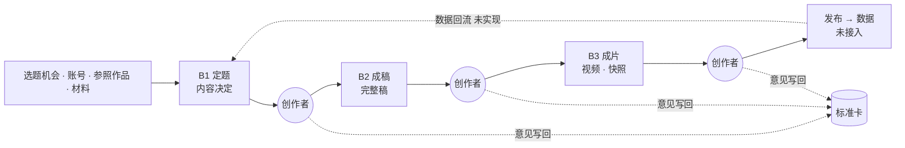
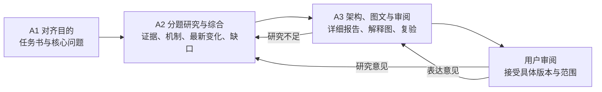
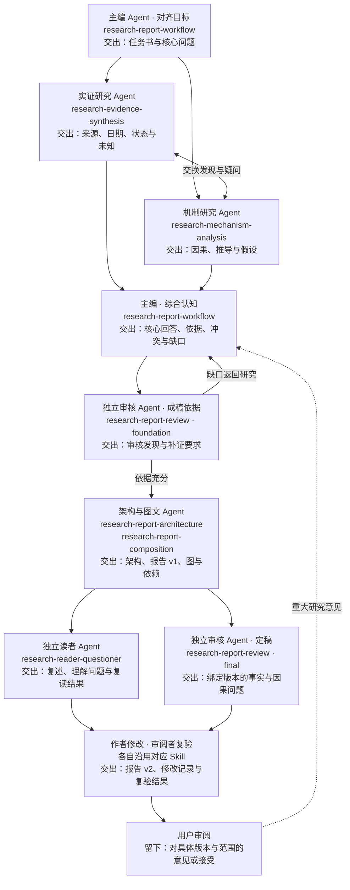
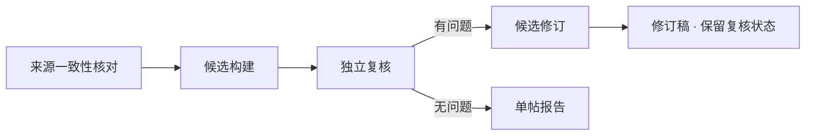
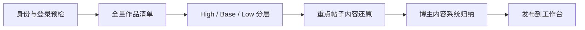

# 三个工作台

研究、分析、创作各自独立，没有必经的先后顺序。研究与分析保留迁入时的流程；创作按新的阶段 workflow 重建。

## 创作工作台

B1 定题 → B2 成稿 → B3 成片。每个阶段由 workflow 里的 Agent 完成，停在创作者关口；阶段之间用作品档案交接。详见[创作文档](../workbenches/creation/docs/README.md)。

技术栈：TypeScript，阶段 workflow 以命令行 + 生成的静态页面运行；文章应用为 React / Vite、Fastify API 与独立 worker。

## 研究工作台

沿用 research-workbench：研究问题、来源、图文报告、意见与修订。技术栈：React / Vite、Fastify、SQLite、独立 worker。详见[研究工作台](../workbenches/research/README.md)。

研究角色与方法

## 分析工作台

沿用 self-media：单帖的内容还原、编导逻辑、画面与剪辑，以及博主内容系统归纳。技术栈：React / Vite、Express、SQLite、分析 worker。详见[分析工作台](../workbenches/analysis/README.md)。

单帖流程：

博主流程：

## 图的来源

研究的阶段图与角色图摘自 token-economics 的 `docs/reports/research-shared-context/index.html`。分析图按 `packages/research/src/creator-research/service.ts` 和 `workflows/simple-review.ts` 的现有阶段绘制，去掉了旧架构图中的多博主 / Wiki 范围。创作图按当前阶段 workflow 的代码绘制；迁入时的旧创作方法图见[旧视频方法](../workbenches/creation/docs/archive/video-method.md)。

这些图说明流程，不表示各流程已经通过完整的真实运行；执行状态以各工作台的实际运行记录为准。
