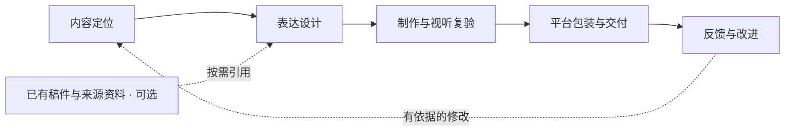

# 创作工作台

移植现有 token-economics 创作工作台：看实际设计与媒体、版本、意见—修订—复验—范围决定。保留原 `.mjs`/esbuild 与表达CLI，不重写框架。默认清单为空，不附带旧作品、账号、私有数据库或媒体。

## 原流程核心阶段



B1保存本期问题、读者与收益；B2交付证据底稿、完整声画设计、开头与标题封面；B3内部先有声样片、再整片，两者各自绑定实际复验。C1保留渠道包、授权与真实回执，C2保留观察窗口与复盘。研究不在此执行；历史报告可作为输入阅读，不能要求先研究再创作。

## 运行

在仓库根目录由统一pnpm workspace安装依赖、构建共享agent-workflow。随后：

```sh
pnpm --filter @creator-lab/creation build
pnpm --filter @creator-lab/creation dev
# 默认 http://127.0.0.1:4337；已有服务占用时使用 PORT=4339
pnpm --filter @creator-lab/creation test
pnpm --filter @creator-lab/creation test:expression
```

工作台服务仅绑定loopback；启动不运行Agent或平台发布。默认工作区`creation`为空，可登记候选与定位。已有能力没有通用“一键创建本期”入口；新资产仍由显式清单登记。服务有正式意见/回应/修订/决定写接口，且不改原正文。

## 显式读取历史资料

```sh
CREATION_CONTENT_ROOT=/absolute/path/to/token-economics \
CREATION_MEDIA_ROOT=/absolute/path/to/videos \
CREATION_STATE_ROOT=/absolute/path/to/new-preview-state \
PORT=4339 pnpm --filter @creator-lab/creation dev
```

CONTENT_ROOT读取原清单、research/episodes/docs/反馈与发布登记；MEDIA_ROOT只读引用媒体，不能默认猜旧目录。STATE_ROOT独立保存workspaces.sqlite、collaboration.sqlite和可重建index.sqlite；默认在本目录data/local/workbench。选择旧content目录不会自动读取或写入旧私有账本。若需历史定位/摘要/意见，用SQLite backup拷贝到新STATE_ROOT后启动，保留原库；不要复制正在写入的单个SQLite主文件。

数据仍按来源workspace/asset ID过滤，历史深链接保留：`/?workspace=<id>&case=<topicId>#artifact=<assetId>&context=<revisionId>&step=B2`。正文、媒体、意见与用户接受分开记录；局部通过不外推全片或发布授权。

## 表达执行与能力边界

`pnpm --filter @creator-lab/creation expression -- prepare /absolute/input.json --model <explicit-model> --effort medium`仅冻结输入；run才调用真实模型。完整使用见[表达入口](tooling/expression-workflow/README.md)。共用仓库根vendor/agent-workflow，不复制引擎。

B2入口仍要求其具体模板所需的实际研究/资料输入；无提示读者隔离、候选hash、修订上限与恢复沿用。它尚未自动登记到工作台，也不生成配音/视频。制作方法调用已有媒体工具，渲染/配音运行时不是本迁移包的新实现。当前素材、审核及平台回执只证明其各自范围。

原五步发布工具保留在tooling/social-publish，仅由显式命令驱动。浏览器提供方/登录态及ffmpeg等按实际环境配置，未搬账号授权或历史任务。原模拟与工具测试不能替代新内容现场校准；本次迁移不运行模型、上传、发布或评论回复。

## 来源

来源仓库[ token-economics ](https://github.com/cyl19970726/token-economics)，基线HEAD `1d733f4242e0464674979bf1681968b5cdc4d9e1`；读取的是当前工作树，含未提交研究接入，迁移已剥离其研究服务/UI。原仓未修改。只搬工作台/相关服务、表达流程、9个完整创作Skill和现有发布助手；不附带episodes、research资料、媒体、旧私有库、vendor、全局工具或无关研究实现。
