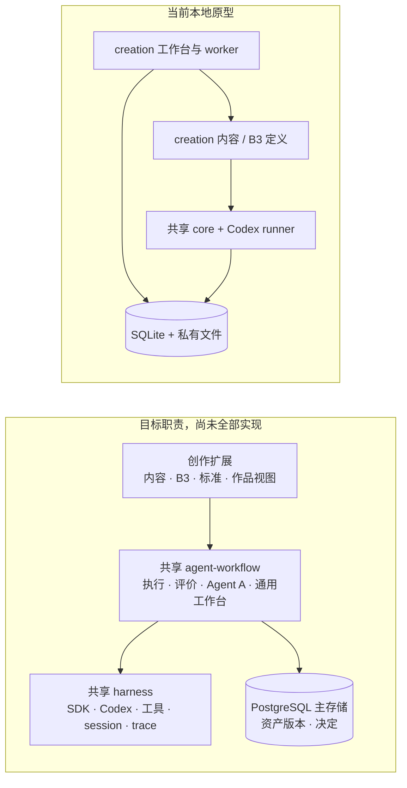

# 创作架构

创作是共享 [agent-workflow 架构](../../../../vendor/agent-workflow/docs/architecture.md)的业务扩展。共享项目负责工作流执行与版本迭代、四问评价、Agent A、资产版本、PostgreSQL 主存储 harness、通用 Agent SDK／Codex 适配、工具与上下文控制、trace／session 和通用工作台。创作提供 `creation.content`、`creation.b3` 的流程与角色，创作标准、制作工具、作品档案和作品阅读视图。共享 [路线图](../../../../vendor/agent-workflow/docs/harness-roadmap.md)描述目标与落地差距；不能把目标画成已经运行的系统。

**当前事实：** 共享包已有 PG 执行账本、[可选 Space 存储与节点合同](../../../../vendor/agent-workflow/docs/space-storage.md)、runtime bridge、只读控制台和 SIWC Responses 适配；一般 Agents SDK、完整媒体存储和生产部署仍未完成。创作已通过确定性 CONTENT、人工交接、B3 fixture 与 v2 演示，但原有本地工作台仍把控制记录与 workflow 账本放在 SQLite，trace、媒体和输入留在私有文件，**没有自动迁入 PG Space**。它验证了部分业务交互，不是目标共享 harness 或真实成片质量的完成证明。[本地原型的入口与运行](business-workbench.md)单独说明。

## 创作扩展在哪里

| 位置 | 创作职责 |
| --- | --- |
| `src/stages/content.ts`、`b3.ts` | 完整内容与制作的 workflow 定义、角色、修订路径和关口详情 |
| `src/stages/brief.ts` | 内容通过后生成确切版本的作品档案，按 B3 角色交接 |
| `src/stages/standards/*.md` | 内容与成品的业务标准卡 |
| `src/stages/runtime.ts` | 当前 Codex 角色配置和模型探针；其中通用运行能力以后归共享层 |
| `scripts/` | 当前 CLI 运行、验收、展示与证据阅读入口 |
| `apps/workbench/`、`src/workbench/` | 当前本地原型的页面、API、worker 与 SQLite 控制记录；通用部分待迁入共享项目 |

旧文章应用位于 `apps/`、`src/application` 与 `src/workflows/article.ts`，有独立[合同](article-app.md)。研究和分析仍是独立工作台，可以作为创作输入来源，但没有强制调用链。

## 两段创作怎样交接

`content` 把研究、定位、完整稿与审阅放在一轮可往返的执行中。完整内容经创作者接受后才生成版本化作品档案，B3 读取档案中对应角色所需的部分；旧 B1/B2 中间验收不再是当前路径。[作品档案与交接](brief-and-handoff.md)说明资产范围，具体角色与返回路径见[内容](../04-workflows/content.md)及[B3](../04-workflows/b3.md)。样片接受只针对样片，不代表全片通过。

制作仍围绕现有视频模板：程序建工程、配音、装配、技术检查和渲染；画面设计者写帧规格，成品检查者看本轮快照。角色报告不能代替真实文件、装配和检查结果。相关具体失败与调优证据见[调优手册](../05-tuning.md)。

## 现有 CLI 与状态

当前 CLI 通过 `ctx.agent` 调角色、`ctx.task` 做确定性步骤、`ctx.publish` 记录产物。`src/stages/runtime.ts` 使用 Codex runner；`CREATION_CODEX_BIN` 指定可执行文件，开跑前模型探针检查兼容性。角色有明确工具和工作目录配置，但现有设置不能证明所有文件读取或 MCP 访问都被隔离。新共享 harness 的权限合同需在目标环境验证。

CLI 私有状态在 Git 忽略的 `.local/stages/<topic>/`：`ledger.sqlite` 记录 run、步骤、事件和资产；`traces/` 留每次可见调用；`decisions.json` 留关口判决；`brief/` 留版本化交接；各 run 目录留输入、产物和展示页。旧 B1/B2 运行目录只作历史读取。当前同一 SQLite 账本一次运行一个 run。新工作台使用另外明确设置的状态根，不自动导入或改写旧 CLI 私有数据。

通用数据模型、版本、评价、恢复与工作台在共享项目定义；创作接入时应保留这些业务资产的准确来源，不长期维护两套相互竞争的通用控制实现。[接入计划](../workbench-implementation-plan.md)列出现有原型和下一步。
