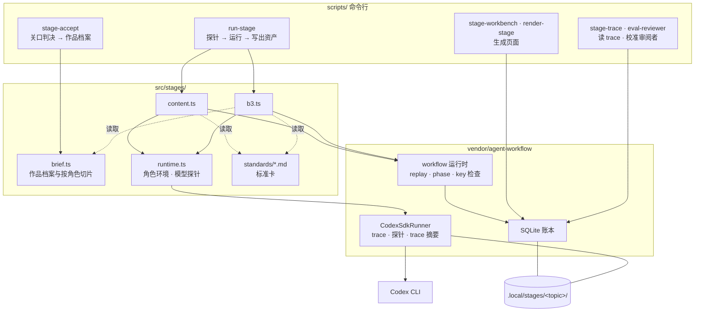

# 架构

**一句话：** 每个阶段是一个 agent-workflow 定义（`src/stages/content.ts` 与 `b3.ts`），角色是 `ctx.agent`，确定性步骤是 `ctx.task`，产物用 `ctx.publish` 发布到 SQLite 账本；命令行脚本负责运行、过关口、生成页面和读 trace。Agent 由 Codex CLI 执行，每个角色的运行环境在代码里显式设置。



## 代码在哪

| 位置 | 内容 |
| --- | --- |
| `src/stages/content.ts` `b3.ts` | 两个交付节点的 workflow：角色定义（任务说明、防的错、输出 schema）、流程、关口详情、`*_REVISION` |
| `src/stages/brief.ts` | 作品档案 schema、关口通过时生成下一版、每个角色拿哪一份 |
| `src/stages/runtime.ts` | 角色运行环境、Codex 可执行文件、模型探针、schema 小工具 |
| `src/stages/standards/*.md` | 标准卡（审阅角色和创作者共用），含创作者的审阅记录 |
| `scripts/` | `run-stage`、`stage-accept`、`stage-workbench`、`render-stage`、`stage-trace`、`eval-reviewer` |
| `tests/stage-*.test.ts` `brief.test.ts` | 用假 Agent 验证流程分支、修订循环、交接切片、角色环境 |
| `apps/` `src/application` `src/workflows/article.ts` | 文章应用（另一条产品线，见[文章应用合同](article-app.md)） |

## 一个阶段 workflow 的构成

- `workflow('creation.content', { revision: CONTENT_REVISION }, …)`：改任何提示词、标准、流程都要升 revision，新 revision 用新 run。
- 角色：`stageAgent(role, model, revision, access)` 生成 Agent 定义；角色规格里的 `guards` 写明它防的错，会显示在阶段页面上。
- 程序步骤（B3 的建工程、配音、装配、检查、渲染）用 `ctx.task`，不交给 Agent。
- 修订循环的 key 用计数器生成（`content-draft-0`、`content-draft-1`…）；agent-workflow 会拒绝同一次执行里重复的 key。
- 阶段以 `needsReview` 结束，详情里是交给创作者的主资产引用和审阅结果；创作者的判决由 `stage-accept` 记录，不写回账本。

## 角色的运行环境

| 设置 | 值 | 原因 |
| --- | --- | --- |
| Codex 可执行文件 | `CREATION_CODEX_BIN`，默认 ChatGPT 应用内的 CLI | SDK 自带的 CLI 拒绝 GPT-6 模型；trace 记录的是实际使用的这个版本 |
| 开跑前 | `probeCodexModel` 探一次模型（`--skip-probe` 可跳过） | 模型不可用时在开始前失败，而不是在中途失败后由主 Agent 接手 |
| 仓库 `AGENTS.md` | 关闭（`project_doc_max_bytes: 0`） | trace 显示内容角色收到了约 1.8 万字工程规范，汇报腔进了脚本 |
| 用户级 `~/.codex/AGENTS.md` | 无法按调用关闭；每个内容角色 prompt 开头声明它不适用 | 同上 |
| 沙箱 | 默认只读；B3 设计者可写（工程目录 + 参照目录），B3 检查者只读工程目录 | 只有产出文件的角色能写 |
| 联网搜索 | 只有内容研究编辑（输入允许联网时） | 其他角色只用给定材料，事实由专门角色负责 |
| 模型 | 默认 `gpt-6-sol`；执行类角色 `medium`，判断类角色（作者、主编、B3 两个角色）`high` | 关键判断用更强的推理 |
| 单次超时 | 15 分钟 | B3 设计者一次改 8 段帧规格约 2–4 分钟 |

给 Agent 的工具提示必须先在它自己的沙箱里跑通过一次：b3-v6 曾提示设计者用截图脚本自检，脚本在无网络沙箱里挂住，设计者又去找浏览器，最后超时。

## B3 的装配线

B3 包住了一条现成的视频模板装配线（来自 token-economics 的 compute-ledger 模板），workflow 只加两个 Agent：

| 步骤 | 执行者 | 模板脚本 |
| --- | --- | --- |
| 建工程、写 SCRIPT/STORYBOARD | 程序 | `new-episode.sh` |
| 配音 | 程序 | `tts.sh`（MiniMax）或 `tts-placeholder.sh` |
| 写每段帧规格 | 画面设计者 | 自测 `build-frames.py --check` |
| 重新构建并核验 | 程序 | `build-frames.py`（不采信设计者自报） |
| 装配、对时、技术检查、快照 | 程序 | `make-index.mjs`、`retime-to-minimax.mjs`、`hf-check.sh`、`snapshot-review.sh` |
| 看图判定 | 成品检查 | 必须打开每张快照拼图；没打开就判 blocked |
| 渲染视频与封面 | 程序 | `render.sh` |

技术检查不通过时，带着出错位置退回设计者，算一轮修改。每轮装配前清空快照目录，检查者只打开这一轮给定的拼图。

## 状态存在哪

所有运行状态都在 `.local/stages/<topic>/`（Git 忽略，属于私有数据）：

```text
.local/stages/<topic>/
  ledger.sqlite          运行、步骤、事件、资产（agent-workflow 账本）
  traces/<run>/<step>/<attempt>/   每次调用的 prompt、输入、事件流、结果（私有）
  decisions.json         创作者关口：每次运行的判决与意见，各阶段当前采用哪次运行
  brief/v<n>.json latest.json      作品档案的各个版本
  content/<runId>/ b3/…  每次运行的冻结输入、逐个资产文件、trace.md、阶段页面
  b3-episode/            B3 视频工程
  index.html             作品工作台
```

旧 b1/、b2/ 运行目录与账本记录保留，只作为历史读取。

同一个账本一次只跑一个 run：SQLite 使用 `delete` 日志模式，并发写入有锁冲突风险。
