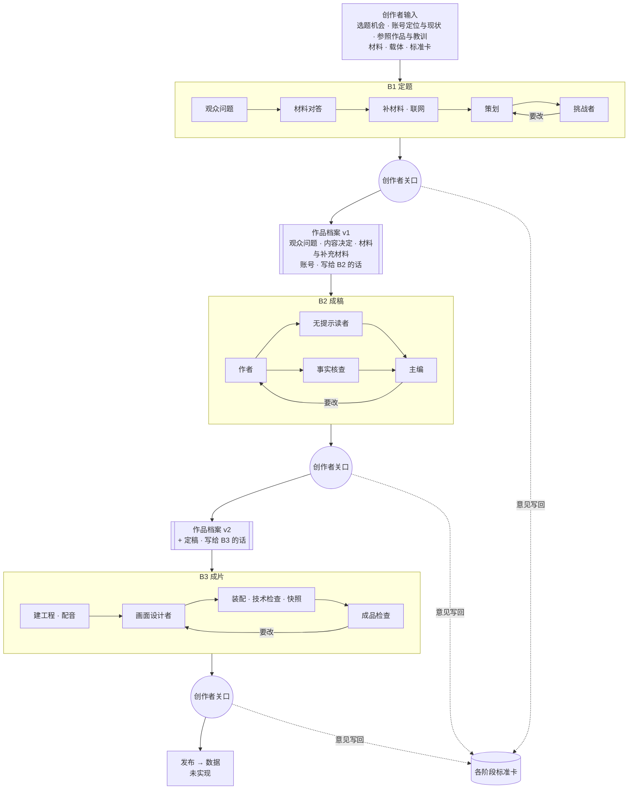

# 作品档案与交接：每个角色拿到什么

**结论：** 阶段之间只通过**作品档案**交接。创作者在关口判“通过”（`pnpm stage:accept`）时，程序先从这次运行自己的产出和冻结输入生成并校验下一版档案 `brief/v<n>.json`，成功后才记录通过判决；下一阶段的输入写 `"briefFrom": "<topic>"`，从当前采用的 `brief/latest.json` 读取，并原样冻结进这次运行，可以复现。每个角色只拿自己那一份。评估运行用 `--keep-current` 时仍保存独立的 `v<n>.json`，但不改变 `latest.json` 或当前采用的运行。需要显式试用某个评估档案时，可以在输入中直接写完整的 `"brief": {…}`，而不是使用 `briefFrom`。

按代码核对：b1-v7 / b2-v7 / b3-v9，`src/stages/brief.ts`。

## 全图

## B1 定题：每个角色的输入与产出

| 角色 | 防的错 | 拿到 | 产出 |
| --- | --- | --- | --- |
| 观众问题 | 从材料出发选题 | 选题机会、账号定位与现状、参照作品、载体、研究材料 | 观众原话式问题、现在的直觉、矛盾点、看完后的变化 |
| 材料对答 | 材料答非所问却没人指出 | 观众问题、研究材料 | “谁在教”的拆解、子问题 direct/partial/none、决定性缺口 |
| 补材料 | 为迁就材料而换题 | 缺口、核心问题；可联网 | 一手来源笔记（链接、要点、填哪个缺口） |
| 策划 | —— | 以上全部 + 标准卡 | 内容决定：核心问题、一句话答案、钩子、3–5 节拍、账号视角、不讲什么、考虑过但没选的答案 |
| 挑战者 | 替创作者先审 | 同策划 + 内容决定 | S1–S10 逐条判定、必须改的地方 |

## B2 成稿

| 角色 | 防的错 | 拿到 | 故意不给 | 产出 |
| --- | --- | --- | --- | --- |
| 作者 | —— | 内容决定、观众问题、选题机会、账号与参照作品教训、载体与时长上限、材料、标准卡、写给 B2 的话 | —— | 完整稿：标题、封面字、每段口播 / 屏幕字 / 画面意图 |
| 无提示读者 | 讲不懂、留不住 | 只有观众看得到的：标题、封面字、口播、屏幕字、画面描述 | 决定、材料、账号 | 复述、跟丢或想划走的段落、3 秒 / 30 秒还看不看 |
| 事实核查 | 说错、说过头；只指错，不许加料 | 稿子、材料 | —— | 错 / 过头 / 无依据 + 等长改法 |
| 主编 | —— | 内容决定、观众问题（判断钩子是否打中原直觉）、账号与参照作品、写给 B2 的话、标准卡、时长、稿子、读者体验、核查 | —— | T1–T8 判定、必须改的地方、给制作的建议（进档案“写给 B3 的话”） |

## B3 成片

| 角色 | 防的错 | 拿到 | 故意不给 | 产出 |
| --- | --- | --- | --- | --- |
| 程序步骤 | 装配线本来就确定，交给 Agent 只会多出错 | 定稿、视频模板、配音方式 | —— | SCRIPT/STORYBOARD、配音时长、技术检查、快照、视频与封面 |
| 画面设计者 | 只登记、不制作 | 每段口播 / 屏幕字 / 画面意图、配音时长、参照帧规格、标准卡、核心问题 / 一句话答案 / 钩子 / 各节拍画面想法、账号名称与定位、写给 B3 的话、修改请求（创作者 > 检查 > 技术） | 研究材料 | 每段一个帧规格 |
| 成品检查 | 看不见图的“通过” | 本轮快照拼图、每段文字、技术检查、标准卡、一句话答案（静音测试对照）、写给 B3 的话 | 研究材料 | V1–V7 判定、按段落的问题和改法；必须列出打开过的图 |

## 档案里有什么、谁拿哪一份

| 档案内容 | 何时写入 | B2 作者 | B2 主编 | 冷读者 | B3 设计者 | B3 检查 |
| --- | --- | --- | --- | --- | --- | --- |
| 选题机会、账号（含参照作品教训） | 创作者给定 | ✓ | ✓ | — | 名称与定位 | — |
| 观众问题（原话、直觉、矛盾） | B1 通过时 | ✓ | ✓ | — | — | — |
| 内容决定（一句话答案、钩子、节拍、不讲什么） | B1 通过时 | ✓ | ✓ | — | 核心问题、答案、钩子、节拍画面想法 | 核心问题、答案、钩子 |
| 材料 + 补充材料（带来源） | B1 通过时 | ✓ | — | — | — | — |
| 写给下一阶段的话 | 每个关口通过时 | 给 B2 的 | 给 B2 的 | — | 给 B3 的 | 给 B3 的 |
| 定稿 | B2 通过时 | — | — | — | ✓ | ✓ |

“写给下一阶段的话”由三部分自动组成：创作者过关口时用 `--next` 写的话；审阅角色判为“偏弱”或未通过、但没有阻止通过的项；B2 还有事实核查给出的改法。

## 为什么这样设计

以前两处交接都靠主 Agent 在会话里用临时脚本拼：B2 丢了观众问题和参照作品教训；B3 只拿到稿子，主编写给制作的“把‘同一基础模型’简化成画面上的同一起点”在路上丢了。改成档案后做了一次对照（同一份 B1 决定、同一份标准，只改交接）：B2 开头从概念题变成直接打中观众直觉，并用了三个具体类比；B3 样片第一轮就没有不通过项。

仍然故意不给的：冷读者只看观众看得到的东西；B3 不拿原始研究材料；B2 拿到的是 B1 已定的决定，没有重新选题的自由。档案也传不了上游没决定的东西：B1 v7 的决定没带具体数字，B2 的开头就一直缺数字。
