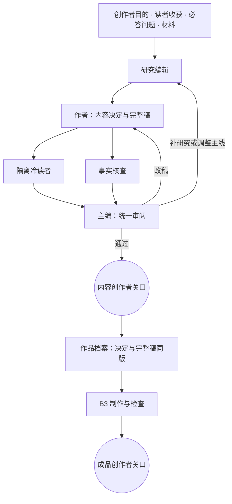

# 作品档案与交接：每个角色拿到什么

**当前交接只有内容 → 制作。** `content` 内部的研究、内容决定、完整稿和审阅都绑定同一运行的版本化资产。内容终点接受时生成一版同时包含内容决定和完整稿的 brief，B3 不再要求先接受 B1 再接受 B2。

## 全图

## 内容流程的上下文

| 角色 | 接收 | 隔离 |
| --- | --- | --- |
| 研究编辑 | 原始目的、读者收获、必答问题、账号与形式、材料；修订时的全文及具体缺口 | 不把旧稿的主线当作不可更改的决定 |
| 作者 | 同一原始目标、材料与研究、当前审阅和人工反馈 | 无必须先过 B1 的要求 |
| 冷读者 | 只有观众可见的标题、口播、屏幕文字和画面意图 | 目的、预期答案、必答问题及研究材料 |
| 事实核查 | 完整稿和累计材料 | 不用准确性审查替代内容目标审查 |
| 主编 | 原始目标、必答问题、全文、冷读疑问、事实核查、标准及反馈 | 不得用自己知道的背景补足稿件没说的解释 |

主编的必答问题覆盖必须指出稿内实际解释以及仍然缺失的部分。事实准确和完整解释分别检查。所有回退保持在同一个 run 内，`maxRevisions` 用尽仍有问题就停在未收敛状态。

## 接受与版本

`pnpm stage:accept <topic> <runId> --verdict accept --reviewer <name>` 从该运行的冻结输入、最终 `content-draft`、研究和审阅生成不可变的 `brief/v<n>.json`；采用时更新 `brief/latest.json`。失败、阻塞或未收敛的内容不能作为通过的内容交接。

评估用 `--keep-current` 仍生成独立版本，但不修改当前采用。B3 输入写 `"briefFrom": "<topic>"`，运行时读取并冻结完整 brief；也可显式提供某个已保存的 `brief`。默认标准同样冻结进运行输入。

## B3 读取什么

| 读取者 | 输入 |
| --- | --- |
| 程序步骤 | 完整定稿、模板和配音/样片范围配置 |
| 画面设计者 | 每段文字和画面意图、核心问题/答案/节拍、账号定位、留给制作的意见 |
| 成品检查 | 本轮原图、段落、技术检查、核心问题/答案、账号与制作意见 |

B3 不接管上游事实研究，也不擅自改写已接受口播。若声画制作发现内容本身需要改，记录具体问题，回内容流程形成新版本。

## 历史兼容

旧 B1/B2 的运行、资产、判决、brief 来源和渲染继续可读。新入口不再创建拆开的 B1/B2 运行；旧档案没有伪造成一个 `content` 来源。`notesForB2` 等历史字段仍可解析，但新内容交接一次就包含 `script` 和 `notesForB3`。

历史教训仍保留：会话中临时拼接输入曾丢掉观众问题、参照作品和制作意见。有版本的档案解决交接问题，但它不能替代对内容是否讲懂的判断。
