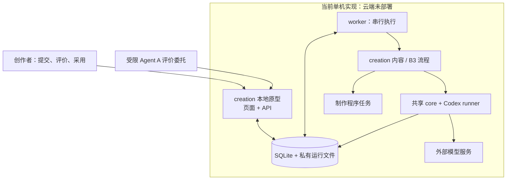

# 本地业务工作台原型：使用与运行

2026-10-03 建立的 `apps/workbench` 是创作业务的**本地原型**，还没有部署到云服务器。它验证了案例、冻结输入、内容与制作执行、作品阅读、四问评价、比较、采用及恢复等交互，但其中不少通用控制暂时写在 creation 内。目标是由共享 [agent-workflow 产品](../../../../vendor/agent-workflow/docs/product.md)及[架构](../../../../vendor/agent-workflow/docs/architecture.md)提供这些能力，创作只提供流程、标准、工具、作品档案和展示扩展。[共享路线图](../../../../vendor/agent-workflow/docs/harness-roadmap.md)区分目标与现状。本页的命令和服务示例描述**现在这套原型**，不是目标共享 harness 的部署手册。

## 当前实现

本地原型采用单机 API 与 worker 两个进程，共用 SQLite 和私有运行文件。worker 在内部调用共享 core 与 Codex runner，Agent 节点经 Codex SDK／CLI 执行。共享包另有[可选 PostgreSQL Space 层](../../../../vendor/agent-workflow/docs/space-storage.md)、节点合同、runtime bridge、只读控制台和 SIWC Responses 适配；**本原型未自动迁入该层**。创作确定性 CONTENT、人工交接、B3 fixture 与 v2 演示已通过；一般 Agents SDK、完整媒体存储、真实 B3 生产和正式部署仍未完成。此阶段不考虑独立或临时 VM。



| 当前代码 | 在原型中做什么 | 目标归属 |
| --- | --- | --- |
| [web](../../apps/workbench/web/src/App.tsx) | 作品阅读、四问、比较和采用界面 | 通用工作台归共享；创作作品视图留本项目 |
| [app.ts](../../apps/workbench/app.ts)、[execution.ts](../../src/workbench/execution.ts) | API、命令校验、任务领取、执行与恢复 | 通用控制和运行合同归共享；创作接入业务定义 |
| [content.ts](../../src/stages/content.ts)、[b3.ts](../../src/stages/b3.ts) | 角色、返工路径、内容和成品关口 | 创作 |
| [agent-workflow](../../../../vendor/agent-workflow/README.md) | 当前 core、Codex runner、SQLite 账本等 | 共享项目继续扩成目标 harness |
| [store.ts](../../src/workbench/store.ts) | SQLite 控制记录与私有文件引用 | 通用主存储转入共享 PostgreSQL 合同 |

本地原型只证明当前代码路径。共享 Space 层已覆盖资产版本、冻结上下文和会话等基础合同；完整一般 Agents SDK、媒体与生产恢复仍需单独验证，不能从这里的 Codex runner 或文件目录推断目标能力已经完成。

## 一份作品怎样经过这套系统

1. **建立案例。** 保存业务目的、必答问题、账号信息与材料；这一步不调用模型。
2. **明确启动一轮。** 保存本轮的流程版本、输入、模型配置、基线和改善假设，进入队列。
3. **形成完整内容。** 研究编辑、作者、冷读者、事实核查和主编在内容 workflow 内协作；有问题可以退回补研究、调整主线或改稿。
4. **评价并决定采用。** 内部审阅结果、用户四问和外部 Agent A 评价分别记录；当前完整内容仍由创作者明确采用，且必须通过程序核验的内容关口。
5. **制作并验收。** 已采用内容生成版本化作品档案，明确启动 B3 后才进入画面设计、配音、装配、检查与渲染；成片另行评价和采用。
6. **进入下一轮。** 选确切基线，把反馈与主要改善假设带入新 run，保留两轮作品、评价、比较和决定。流程代码或提示词需要改动时，由开发者修改并重新启动服务载入新版本；工作台当前不自动改写自身流程，也不自动发布内容。

## 历史为什么能放在同一个空间

“空间”目前是案例及其关联记录，加上服务器上的持久目录；不用靠每个案例分配一台 VM 来建立关系。

| 标识 | 回答的问题 | 例子 |
| --- | --- | --- |
| workflow ID | 哪一类业务流程 | `creation.content` / `creation.b3` |
| revision | 当时使用哪一版做法和执行配置 | 代码、标准、依赖和执行文件的快照指纹 |
| case | 在为哪一项具体业务任务工作 | 某一条要制作的内容 |
| run | 这是第几次实际尝试 | 同一案例的基线运行、反馈后的候选运行 |
| step / attempt | 哪个步骤的哪次执行 | 作者的某次调用及可用会话记录 |
| artifact / review / comparison / decision | 得到了哪份产物、怎样评价、与谁比较、最终采用了什么 | 确切稿件及哈希、四问、比较、采用原因 |

一个案例可以有多次运行；每次运行绑定一个流程版本。产物、评价、比较和采用继续关联到确切版本。进程结束后，这些记录和文件继续保留。一次运行的步骤及 Agent trace 可以从该运行追查；工作台不会取得供应商未暴露的内部推理。

## 当前有哪些入口

| 入口 | 默认端口 | 当前定位 |
| --- | --- | --- |
| 本文所在文档站 | 4340 | 静态说明页面，不执行创作业务 |
| 新业务工作台 | 4341 | 新界面和 API；后台 worker 另行启动，开发界面可用 4342 |
| 旧文章应用 | 4337 | 旧界面、API 和文章 workflow；仍由根目录的 `pnpm creation` 启动 |

当前处于新旧入口并存的过渡阶段。新工作台使用 `pnpm --dir workbenches/creation workbench` 和 `workbench:worker`，尚未替换旧默认命令；旧应用不是新工作台的一层，历史数据也没有自动混入新库。

在整个 Creator Lab 中，研究、分析、创作仍是三个独立工作台。研究与分析结果可以成为创作材料，没有强制的“先研究、再分析、最后创作”调用链。当前这些网页地址都是本机地址；云端部署完成后才有跨设备可访问的业务域名。

## 一台服务器怎样启动

准备一台能运行 Node 24 的专用 Linux 服务器、一个只用于此业务的系统账户、持久磁盘和已解析到该服务器的域名。服务器目标、系统依赖、模型账号和费用须由实际部署环境确定；当前没有服务器信息，也没有云端部署或手机访问的实测结论。

1. 将本仓库检出到服务文件预设的 `/opt/creator-lab`，递归初始化**固定提交**的 `vendor/agent-workflow` 子模块；在仓库根目录用锁文件安装依赖并构建：

   ```bash
   git submodule update --init --recursive
   corepack enable
   pnpm install --frozen-lockfile
   pnpm --filter @creator-lab/creation build
   ```

2. 创建 `creator-workbench` 专用账户，以及仅该账户可写的 `/var/lib/creator-workbench/state` 和独立的 `/var/lib/creator-workbench/codex`。将 [环境示例](../../deploy/workbench.env.example)复制到仓库外的 `/etc/creator-workbench.env`，限制为管理员可读。至少填写 `WORKBENCH_STATE_ROOT`、`WORKBENCH_PUBLIC_ORIGIN`、`WORKBENCH_ACTOR_ID`、随机且独立的 `WORKBENCH_ACCESS_TOKEN`、`CREATION_WORKBENCH_CODEX_HOME` 和 `CREATION_CODEX_BIN`。API 默认只监听 `127.0.0.1:4341`；口令不得使用示例值。不要复制个人 `CODEX_HOME`、本机登录状态、API 密钥或私人报告到仓库或备份目录。

3. 在服务器安装**实际可执行的 Codex CLI**，将其绝对路径写入 `CREATION_CODEX_BIN`。通过 SSH 以专用服务账户显式完成认证；登录 CLI 时设置 `HOME` 和 `CODEX_HOME` 都指向服务配置中 `CREATION_WORKBENCH_CODEX_HOME` 的目录（CLI 不识别这个项目专用变量），并在该账户下核对 CLI 版本、登录状态及所选模型是否受支持。工作台虽使用 Codex SDK，SDK 随包的 CLI 版本可能不支持当前 GPT-6 模型名称；只有目标机上真实运行成功才算模型能力已验证。服务进程不应继承操作者个人配置。其他供应商或制作凭证仅放入服务器受限环境，不能通过浏览器提交。

4. 核对 [API service](../../deploy/creator-workbench-api.service)、[worker service](../../deploy/creator-workbench-worker.service) 的账户、工作目录、Node 24 绝对路径及环境文件位置，再安装并启动两个 systemd 服务。API 与 worker 共用同一个 `WORKBENCH_STATE_ROOT`；worker 持有唯一执行锁，API 持有自己的服务锁。当前一台服务器的 SQLite 控制库一次只允许**一条运行执行**，每个案例也只允许一条排队或运行中的任务。打开或刷新页面不会调用模型；只有明确提交运行命令才会排队。启动 worker 会继续处理已排队的任务，中断任务须显式恢复。

5. 将 [Caddy 示例](../../deploy/Caddyfile.example)中的域名换成实际域名，配置 HTTPS 反向代理到本机 `127.0.0.1:4341`。检查公网 DNS、TLS、登录、同源写入限制和防火墙后，才能在手机上用该域名打开工作台。不要直接把 API 的本机端口暴露给公网。

开发机可在 `workbenches/creation` 下运行 `pnpm workbench` 与 `pnpm workbench:worker`，但本地页面能打开不等于云端服务、模型或制作链可用。服务示例使用 `node --import tsx`，因此目标机须保留安装后的运行依赖；上线前还应核对服务账户对代码只读、对状态目录可写。

## 从内容到制作

创作者先建案例，提供目标读者、必答问题、账号定位、材料和是否允许网页研究。内容运行冻结这些输入、实际配置和代码／标准快照；每次改动要新建候选运行。worker 调用当前安装的 `creation.content` 定义；工作台保留原生 workflow run、步骤、尝试、事件、资产和可见 trace。失败或中断先看运行详情和故障记录；只在相同定义、输入及环境核对通过时显式恢复，否则建立新候选。

对交付稿回答四问：**好在哪里、不好在哪里、比上一版提升了什么、仍有什么不满意**。首轮第三问可写“建立基线”。评价绑定资产 ID、SHA-256、标准版本和评价者；提交评价本身不会采用、开始制作或发布。比较应引用同一交付类型的两份确切资产和各自的评价；工作台记录输入、配置和标准差异。不同标准下的评价只能留下比较限制，不能当成同口径 A/B 质量证明。

创作者明确采用经过真人通过评价及内容关口核验的完整稿后，系统保存相应版本的作品档案；随后才能提交 `creation.b3`。制作还需配置 `CREATION_B3_TEMPLATE_DIR`、`CREATION_B3_REFERENCE_DIR`，目标环境有真实模板、参考文件及字体、浏览器、ffmpeg 等渲染依赖。Linux 上占位配音依赖的 macOS `say` 不可用；选择受支持的配音路径时，服务端须配置相应凭证，例如 `MINIMAX_API_KEY`。B3 的 sample 接受仅代表该样片，不代表完整制作通过；样片和完整制作的接受都要核对实际视频文件、最终检查结果和对应画面证据。产物采用与 workflow 版本采用分别记录；采用一份稿或视频不会自动证明流程普遍有效，也不会自动发布。

工作台允许案例所有者创建短期 Agent A 评价委托。所有者用 `POST /api/workbench/review-assignments` 提交确切 `artifactId`、`sha256`、可选基线的 ID 与哈希、`standardVersion` 及 `expiresInMinutes`（1–480）；返回的 bearer 凭证只允许读取委托范围内的交付资产／媒体并向对应案例提交四问评价。Agent A 不能凭此查看内部研究与运行 trace，不能比较、采用、恢复或启动运行。当前没有自动评价器或自动派发；模型、提示词版本及实际可见材料由提交者自报，系统记录但无法独立证明其真实性。所有者必须自行保管和传递该短期凭证。

## 离线备份与恢复

状态根内含控制 SQLite、原生执行账本、trace、运行目录和媒体；备份应进入独立受限磁盘或备份位置。`workbench:backup` 需要**API 与 worker 均已停止**，会尝试同时取得两把服务锁；拿不到锁就拒绝备份。它只复制普通文件，拒绝符号链接及源目录内的目标路径，排除锁与常见凭证／`CODEX_HOME` 路径，清单对每个文件记录 SHA-256、模式和大小，并另记备份创建时间和 SQLite schema 版本；复制后检查 SQLite 完整性及外键。

在确认两个服务已停后，从仓库根目录执行，替换下列路径为真实路径：

```bash
sudo systemctl stop creator-workbench-worker creator-workbench-api
pnpm --filter @creator-lab/creation workbench:backup backup /var/lib/creator-workbench/state /secure-backups/workbench-2026-10-03
```

恢复先校验清单、文件哈希和 SQLite，再复制到**新的空目录**；不会覆盖现有状态。保留旧状态目录，切换 `/etc/creator-workbench.env` 的 `WORKBENCH_STATE_ROOT` 到恢复目录，确认恢复目录归 `creator-workbench` 账户所有、保留私有权限，经所有者检查后启动服务：

```bash
pnpm --filter @creator-lab/creation workbench:backup restore /secure-backups/workbench-2026-10-03 /var/lib/creator-workbench/restored-state
sudo chown -R creator-workbench:creator-workbench /var/lib/creator-workbench/restored-state
sudo systemctl start creator-workbench-api creator-workbench-worker
```

恢复工具不复制 Codex 登录与凭证；新机器须重新配置专用账户、CLI 和认证。运行中保存的制作绝对路径、定义快照和依赖可能与恢复环境不同，不能因数据库可读就假定旧任务可续跑；核对失败时保留历史，另建候选。正式部署前应在目标环境做一次停止服务、备份、恢复、只读核对及启动演练。

## 当前验收边界

2026-10-03 的原型检查记录：本地已通过 119 项 creation 测试、类型检查和两套页面构建；文档构建通过 44 页内部链接校验。浏览器在隔离测试数据中走通两轮替身 Agent 的真实 workflow 定义、四问评价、比较、采用及未收敛稿件的拒绝；桌面 1440px 与手机 390px 布局检查无页面横向溢出。这些结果能证明已检查的功能和界面，不证明模型结果达到业务标准。尚未有目标云服务器、手机端 HTTPS 实测、真实模型运行、Linux B3 配音／渲染全链路质量验收或跨案例的评价校准。上述各项需在实际环境分别记录结果和失败证据。
