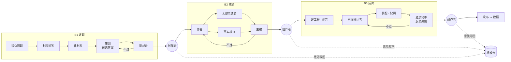

# 工作流：B1 定题 · B2 成稿 · B3 成片

每个阶段都是“一个决定 + 一份主资产 + 一张标准卡”：角色各防一种常见失败，审阅角色按标准卡判，阶段结束停在创作者关口，意见写回标准卡。

| 阶段 | 本质问题 | 主资产 | 审阅 | 当前版本 | 文档 |
| --- | --- | --- | --- | --- | --- |
| B1 定题 | 选对这一篇要回答的问题，并确认答得上、答得好 | 内容决定 | 挑战者（S1–S10） | b1-v7，标准卡 v6 | [B1](b1.md) |
| B2 成稿 | 让答案被观众跟上，并愿意看完 | 完整稿 | 无提示读者 + 事实核查 + 主编（T1–T8） | b2-v7 | [B2](b2.md) |
| B3 成片 | 成品把稿子讲出来，而且在手机上看得清 | 成片 + 快照 | 成品检查（V1–V7，必须看图） | b3-v9，标准卡 v3 | [B3](b3.md) |

每篇阶段文档的结构相同：本质问题 → 最终形态（流程图 + 角色表：防的错、证据来源、产出）→ 调优记录（每一版改了什么、依据什么证据、结果如何）。

## 阶段之外

| 文档 | 内容 | 状态 |
| --- | --- | --- |
| [发布后互动与效果回顾](after-publish.md) | 发布后 48 小时评论互动、48/72/96 小时数据快照与复盘 | 协议已定，未接入这套 workflow |
| [创作方法 skills](skills-map.md) | 本工作台 `.agents/skills` 里九个视频方法包的入口 | 历史方法资料，未接入阶段 workflow |

阶段之间怎么交接，见[作品档案与交接](../03-architecture/brief-and-handoff.md)。
