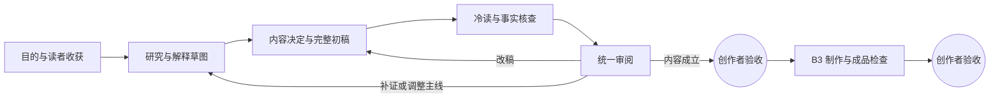

# 工作流：内容形成与制作

职责是否值得区分，和是否需要独立验收，是两件事。当前以两项可审阅交付为准：一份读者能理解的完整内容，以及准确传达它的成品。

| 流程 | 价值 | 主资产 | 验收 |
| --- | --- | --- | --- |
| [内容迭代](content.md) | 通过试写不断修正问题、研究与解释 | 完整稿及内容决定、证据、审阅 | 一次内容创作者关口 |
| [B3 制作](b3.md) | 将相对稳定的稿件转成有效声画 | 视频、封面和快照 | 成品创作者关口 |

原 B1/B2 方法和运行证据见[历史 B1](b1.md)、[历史 B2](b2.md)，不再要求新内容先后过这两道关口。回退都保留在同一个内容 run 中，不通过反复创建人工 brief 来拼接。

## 流程之外

[发布后互动与效果回顾](after-publish.md)尚未接入自动执行；[创作方法 skills](skills-map.md)是现有方法资料。研究和分析是可选输入提供方，不构成强制前置工作台。
