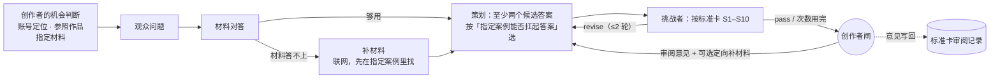

# B1 定题 workflow

> 历史流程。2026-10-03 用户授权将 B1/B2 合并为[内容迭代](content.md)。以下保留当时的方法和验证记录，不再作为新内容运行的前置关口。

代码：`src/stages/b1.ts`（当前 `b1-v7`）　标准卡：`src/stages/standards/b1.md`（v6）　运行：`pnpm stage b1 <input.json>`

## 本质问题

**选对这一篇要回答的问题，并确认我们答得上、答得好。**

观众心里的疑问、我们手里的材料、账号能提供的视角，三者不会自动对上。B1 要把它们对上：对不上时先补材料、再找连接点；实在接不上就停下来问创作者，而不是悄悄换题或换材料。B1 的产物是一个**能被推翻的创作决定**——之后 B2、B3 的所有投入都押在它上面，所以它错了代价最大。

## 最终形态

| 角色 | 防的错（设计动机） | 证据来自 | 产出资产 |
|---|---|---|---|
| 观众问题 | 从材料出发选题，写成"X 流水线是怎样的" | Codex 旧版 B1 输入只有研究摘记，问题是"材料分别怎样展示…"（01a0e23b） | `b1-audience-question`：观众原话式问题、直觉、矛盾、看完的变化、需求依据分级 |
| 材料对答 | 材料答非所问却没人指出 | 第 1 轮它指出"材料没有证明弱 AI 教出强 AI"，这是之前 5 天没人说出的事 | `b1-evidence-map`：拆开字面前提与矛盾、"谁在教"的角色分解、子问题 direct/partial/none、决定性缺口 |
| 补材料 | 为迁就材料而换题 | v1 研究只搜字面 "weak-to-strong"（trace 搜索词） | `b1-research-notes`：一手来源、要点、填哪个缺口 |
| 策划 | —— | —— | `b1-content-decision`：核心问题、一句话答案、钩子、3–5 节拍（带依据）、账号视角、不讲什么、最大风险、**考虑过但没选的答案** |
| 挑战者 | 替创作者先审 | —— | `b1-challenge`：S1–S10 逐条判定、必须改的地方 |

交给 B2 的是：创作者闸通过的那份内容决定 +（可选）审阅者给 B2 的意见。

## 调优记录

每一版都在**同一份冻结输入**（Kimi/GLM「弱模型怎么训出强模型」）上重跑；"盲跑"指不给任何人工审阅意见、标准卡里去掉本题审阅记录。

| 版本 | 改了什么 | 为什么（证据） | 结果 |
|---|---|---|---|
| b1-v1 | 首版 | —— | 盲跑：把 Kimi/GLM 写进"不讲什么"，改讲 OpenAI 论文；挑战者 pass；代理审阅 revise |
| b1-v2 | 支持创作者审阅后重跑（审阅意见优先级最高、可带定向补材料请求） | 人的意见需要进入流程，而不是人自己改稿 | 带审阅重跑：找到"判卷"机制，一手来源到位；接受 |
| b1-v3 | 关掉项目 AGENTS.md 注入 + 内容角色声明；材料对答区分字面前提与矛盾；补材料先搜机制；策划不许丢指定案例、一案例一节拍；标准卡新增 S9/S10 | trace 第 6 行：内容角色被灌入 ~18k 字工程规范；搜索词只有字面；B2 连续 4 版卡在交错案例 | 盲跑：保留 Kimi/GLM、一案例一节拍、账号视角具体；答案仍不够锋利 |
| b1-v4 | S2 写成可检验的问题；S7 要数限定语 | 校准：挑战者漏判 S2 | 盲跑：答案机制改用 OpenAI 弱标签，Kimi/GLM 只当背景 |
| b1-v5 | 材料对答分解"谁在教"；策划列候选答案并按"指定案例能否扛起答案"选；S9 加严 | 两次盲跑方向随搜索结果漂移 | 盲跑第 1 版**自己找到"出答案的不一定是判对错的"**；但挑战者要求证明观众的字面前提，把好答案一路审成"暂缓" |
| b1-v6 | 挑战者：字面前提可以被纠正，不要求证明被纠正的前提；S3 只查节拍里说出的话 | 校准：正面案例 c5 被错杀 | **盲跑 1 轮通过，代理审阅也通过（独立一致）** |
| b1-v7 | S6：一个节拍只讲一个点（一个机制或证据、最多两句、新专有名词≤2） | B2 在 b1-v6 决定上 3 轮未收敛，冷读者每轮都在塞了 4–5 个概念的 Kimi/GLM 节拍跟丢 | 盲跑 3 轮通过（挑战者先后抓到 S10 交错、S3 证据）；3 个节拍各两句；答案变成"练完的模型超过做题时的自己"，"谁来判"不如 v6 清楚，第 3 节拍缺依据——代理审阅：可用，附意见 |

下一刀（已知问题）：v6 与 v7 的答案锋利度此消彼长——v6 讲清"谁来判"但节拍太满，v7 节拍轻了但"判卷"弱了。候选改法：S2 的检验句加"答案要说出'教'的那个角色是谁"；并把 v6 决定（节拍过密）加入校准集作为 S6 的反例。

## 挑战者校准

`pnpm stage:eval-reviewer b1 .local/stages/eval/b1-challenger`：把人已经判过的决定喂给挑战者，比较结论和不通过项。

| 案例 | 人 | 挑战者（v3 标准卡时） | 挑战者（v5 标准卡，当前） |
|---|---|---|---|
| c1 丢掉指定案例 + 泄气答案 | revise（S2、S9） | revise，漏 S2 | 不通过（判 blocked），无遗漏 |
| c2 案例交错 | revise（S10） | revise | revise，无遗漏 |
| c3 "弱 AI 提供线索" + 三处限定 | revise（S2、S7） | —— | revise，无遗漏 |
| c4 指定案例只当背景 | revise（S9） | —— | revise，无遗漏 |
| c5 已纠正前提的好答案 | pass | —— | revise（只挑了一处 S10 小瑕疵，不再错杀答案） |

放不放行一致 4/5；人判不通过的项零遗漏；它比人更严（多判 S3/S7/S10）。这张表是"B1 这道闸能不能交给 agent"的依据：在更多题目上保持这个水平，并且正面案例不再被拦，才能撤掉人工闸。
