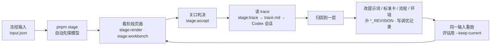

# 调优手册

**这一页讲怎么在本项目里调一轮 workflow。** 通用方法（为什么这样调、归因到哪一层）见 agent-workflow 的[调优循环](../../../vendor/agent-workflow/docs/tuning-loop.md)。

## 一轮怎么做

1. **冻结输入。** 每个阶段一份 `input.json`，反复使用。B2/B3 写 `"briefFrom": "<topic>"`，运行时从当前采用的 `brief/latest.json` 取，并原样冻结进这次运行的 `input.json`。要试用某个评估档案 `brief/v<n>.json`，则把该文件内容直接写入输入的 `brief` 字段。
2. **真跑。** `pnpm stage <b1|b2|b3> <input.json>`。开跑前自动探一次模型，账号用不了就直接报错退出；不要改成手工完成这一阶段。
3. **看结果，过关口。** 先看阶段页面上的主资产和审阅结果，再用 `stage:accept` 记下判决。意见用 `--note`（给这一版）和 `--next`（给下一阶段）区分。B1/B2 判通过时先校验并保存不可变的作品档案，再记录判决。评估用的运行加 `--keep-current`：仍生成独立的 `brief/v<n>.json`，但不更新 `brief/latest.json` 或作品当前采用的运行。
4. **读 trace。** `pnpm stage:trace <topic> [runId]` 生成 `trace.md`：每个角色每次调用的耗时、token、prompt / 输入 / 输出字符数、搜索词、命令（含失败的）、改动文件、错误，以及 Codex 会话文件路径。需要逐行查证时，按这个路径读会话（大文件用 session-forensics 的有界钻取），不要按“最新修改时间”找会话。
5. **归因并只改一处。** 改完升对应阶段的 `*_REVISION`，在阶段文档的调优记录里加一行：改了什么、依据哪条证据。
6. **同一输入重跑，对比。** 初稿对初稿、终稿对终稿。更好且没有退化才保留。

## 命令

在 `workbenches/creation` 下运行，Node 24。状态都在 `.local/stages/<topic>/`。

| 命令 | 用途 | 常用参数 |
| --- | --- | --- |
| `pnpm stage <b1\|b2\|b3> <input.json>` | 跑一个阶段，资产逐个写成文件 | `--model gpt-6-sol`、`--worker-effort medium`、`--judge-effort high`、`--resume <runId>`、`--skip-probe` |
| `pnpm stage:accept <topic> <runId>` | 创作者关口：记录判决；B1/B2 通过时生成下一版作品档案 | `--verdict accept\|revise\|invalid`、`--reviewer`、`--note`、`--next`、`--purpose`、`--keep-current` |
| `pnpm stage:workbench <topic>` | 作品工作台 `index.html`：三个阶段各一行 + 作品档案 + 全部历史 | |
| `pnpm stage:render <topic> [runId]` | 一次运行的阶段页面（默认最新一次） | |
| `pnpm stage:trace <topic> [runId]` | 一次运行的 trace 摘要 `trace.md`（默认最新一次） | |
| `pnpm stage:eval-reviewer <b1\|b2> <casesDir>` | 审阅者校准：一致率、漏判项、多判项 | `--model` |

环境变量 `CREATION_CODEX_BIN` 指定 Codex 可执行文件，默认用 ChatGPT 应用内的 CLI。

## 评估：四个问题

| 问题 | 怎么看 |
| --- | --- |
| 内容是 workflow 做出来的吗？ | 每份资产都有生产者记录；主 Agent 代写一次就算这一阶段失败 |
| 它自己收得住吗？ | 修订轮数、是否“没收敛”、用时 |
| 它的审阅者和人判断一致吗？ | `stage:eval-reviewer`：拦得住坏的，也不错杀好的。这是撤掉人工关口的依据 |
| 同一份输入，改完比改之前好吗？ | 同题盲跑：输入里不带人工意见，标准卡去掉本题的审阅记录，看需要人介入的程度是否下降；最终还要看发布后的数据 |

**盲跑**的做法：输入里不放 `prior` 和 `humanReview`，并在输入的 `standards` 字段放一份删掉本题审阅记录的标准卡（不填时默认读 `src/stages/standards/`）。

**审阅者校准**的案例是人已经判过的产物，每个案例一个 JSON：`{ id, note, expected: { verdict, failing: ["S9", …] }, reviewInput: {…} }`。校准集必须同时有正例（人判通过）和反例（人判要改），否则只能测出“太松”，测不出“太严”。

## 当前评估结论（2026-09-30）

**行，但只在一个题目上证明过。**

| | B1 定题 | B2 成稿 | B3 成片 |
| --- | --- | --- | --- |
| 内容是 workflow 做的吗 | 是（所有版本） | 是（所有版本） | 是：设计者写帧，程序装配渲染，主 Agent 未动一帧 |
| 自己收得住吗 | 调优前需要人纠正方向；b1-v6 盲跑 1 轮通过，b1-v7 盲跑 3 轮通过 | 调优前三份决定都跑满 3 轮不收敛；b2-v6 起 1 轮通过 | 样片 2 轮；全片（b3-v6）2 轮，含 1 轮技术修复 |
| 审阅者和人一致吗 | 挑战者校准：放行判断 4/5 一致，人判不通过的项零遗漏（比人严） | 主编校准 2/2 一致 | 调优前漏判两次；调优后与人一致，但检查者见过审阅记录，还没有独立校准 |
| 同一输入改完更好吗 | 是：从丢掉指定案例、答案泄气，到指定案例扛起答案、零人工介入 | 是：从不收敛到 1 轮通过，事实零问题；档案交接后开头直接打中观众直觉 | 是：从数字卡到静音可懂；版式问题修正；首帧不再为空 |

从选题到全片，人介入的次数：B1 1 次（调优前），B2 2 次，B3 2 次，全部是审阅意见。

## 踩过的坑

| 坑 | 怎么发现的 | 现在怎么防 |
| --- | --- | --- |
| 内容角色被灌入约 1.8 万字工程规范 | 读 Agent 会话首条注入 | 关闭仓库文档注入；内容角色 prompt 开头声明全局工程约定不适用 |
| SDK 自带 CLI 拒绝 GPT-6，主 Agent 接手 | 失败信息；trace 里的 CLI 版本 | 指定可执行文件；开跑前模型探针 |
| 修订轮“改完了”但稿子没变 | trace 里没有第二轮写作调用：重复的 phase key 被 replay | 草稿 key 用计数器；agent-workflow 拒绝重复 key |
| 最后一轮主编意见没人执行；照改后又出事实错误 | 对比终稿与主编意见 | 次数用完仍按最后意见改一次，改后必过事实核查；“通过但附修改”只改点名处 |
| 代理审阅者自己的意见写错了事实 | 事实核查拦下 | 人的修改也过事实核查 |
| 挑战者先太松、后太严 | 校准集：正例被错杀、反例被放过 | 正反案例一起校准；字面前提可以被纠正 |
| 主编永不收敛 | 逐轮对比：每轮都挑新的“可以更好” | 标准分为硬标准和改进项 |
| B3 设计者引入未声明字体，整个运行崩掉 | 技术检查 RED 直接抛错 | 技术检查不通过时退回设计者，带出错位置 |
| 成品检查员根据旧截图误报 | trace：它打开的是审阅者留下的旧图 | 每轮清空快照目录；观察者自己的图放在运行目录，不放进工程 |
| 自检提示让设计者超时 | trace：截图脚本在沙箱里挂住，它又去开浏览器 | 删掉提示，禁止自己截图或开浏览器；工具提示先在 Agent 沙箱实跑 |
| 0 秒首帧为空，复发两次 | 快照 | 入场动画从可见状态开始 |
| 进度探针拿到了别的项目的会话 | 会话内容对不上 | 只按 thread id 找会话 |
| `stage:trace` / `stage:render` 默认取到最早一次运行 | 默认输出是 b1-v1 | 账本按新到旧返回，默认取第一条 |

## 下一轮

- **换题验证迁移：** 用新题（例如 MiMo）从 B1 盲跑到 B3，看人工介入次数和审阅一致率能否保持。所有标准卡和提示词都可能对当前题目过拟合。
- **B1 答案锋利度与节拍密度：** b1-v6 讲清了“谁来判”但节拍太满，b1-v7 节拍轻了但钩子缺具体数字。候选：S2 要求答案说出“教”的那个角色，S4 要求具体事实；把 v6 决定作为 S6 反例加入校准集。
- **B3 检查者独立校准；** b3-v7 的“报错带位置”要等技术检查再变红时验证；账号名大小写待修。
- **正式配音：** 需要创作者配置 MiniMax 密钥与声音。
- **回写自动化：** B2 发现的问题回写 B1 标准卡仍是手工；发布数据回流到下一篇 B1 还没实现。
