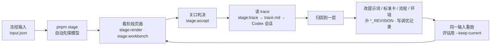

# 调优手册

**这一页讲怎么在本项目里调一轮 workflow。** 通用方法（为什么这样调、归因到哪一层）见 agent-workflow 的[调优循环](../../../vendor/agent-workflow/docs/tuning-loop.md)。

## 当前 CONTENT：在 Workflow Space 中迭代

当前 CONTENT 的方法、输入清单、运行、资产和评价以 PostgreSQL 中的 Workflow Space 为正本。不要将下面保留的旧阶段文件流程误认为当前 Space 的存储方式。共享操作语义见[验证与比较](../../../vendor/agent-workflow/docs/workbench-validation-implementation-2026-10-06.md)，领域具体步骤是：

1. 从真实历史稿件与审阅定位问题，写一个可被反驳的改动假设。
2. 发布基线和候选的准确可执行版本，冻结同一案例输入、角色模型、返工预算、评价标准及判者配置。通常只改变一个业务变量。
3. 经工作台或CLI按冻结计划运行；保存所有失败、会话及资产。同一run中的多次改稿不算多个方法版本。
4. 由人或可信独立Agent对准确产物回答四问，分别比较初稿与终稿；Agent不能冒充用户。工程通过、内容改善和作品接受分别判断。
5. 认知侧实际阅读结果，写有证据的改善、退步与未解问题。只有明确的采用决定才改变采用指针；注册方法本身不表示采用。

## MiMo 前瞻对照（2026-10-06，额度阻断）

已沿用真实Space中的MiMo输入：11份材料、不开新增联网、最多两次改稿、原始五个必答问题、无固定时长上限。旧最终稿已有具体尝试例子，本轮候选仅追加作者解释策略，展开“评分目标—参数与输出概率的计算关系—小幅更新—下一次选择”的桥梁。两版同为gpt-6-astra / low，在当前相同源码上重新跑；旧历史run不冒充当前前瞻基线。

冻结后两版各实际调用一次，但均在第一个研究节点遇到`subscription_sharing_usage_limit_exceeded`，未生成新稿。独立Agent A无可评价对象，未开始业务评价，未形成质量比较，也没有接受或采用。调用、版本、输入、错误及会话已保存；不存在内容改善证据，也不能据此否定作者策略。

本轮最小适配及可信判者落库路径已通过工程核验；一处并发创建输入清单测试首跑失败、单独重跑通过，未声称修复，本次复用已有准确清单。完整认知、测试边界与恢复条件见[第5轮认知结论](../../../vendor/agent-workflow/docs/cognition-execution-loop.md#10-第-5-轮真实-mimo-方法对照)。下一步先恢复原执行条件，保留失败再继续对照；不得为绕过额度静默换模型或改标准。

用户随后指定Luna high。核对订阅模型列表并明确披露后，使用该账户支持的`gpt-5.6-luna / high`，两版CONTENT与独立Agent A统一换型，另建前瞻计划，原输入、标准和作者策略保持不变。两版真实研究节点请求仍被同一订阅共享额度错误拒绝，未生成稿件，也未执行独立评价；模型配置已保留，内容质量仍未知。旧Astra失败没有被覆盖或混入新计划。

当日17:56（台北时间）用户报告可能已有额度后，再恢复一次。执行器声明与校验的指纹变化要求新建同条件版本和计划；本次仅先跑基线，研究节点仍被相同额度错误拒绝，候选明确未启动，Agent A与比较也未启动。无新稿件，无自动重试；原失败全部保留。完整证据在 `.local/cognition-loop/round-05/luna-recovery-02/`，内容策略效果仍未知。

当前Space入口的五个Agent角色与独立Agent A均通过自建SIWC Responses适配器执行，工具限于读取绑定资产；`agent-sdk`分类不代表已接入官方OpenAI Agents SDK。下面的旧阶段CLI才使用Codex执行器，二者不要混用。

## MiMo 修复后前瞻对照（2026-10-07）

已在同一 Space 冻结替代计划 `space-production-b-repair01-mimo-luna-high-20261007`，保留此前额度失败及首次冷读输入契约故障。原11份材料、五问、不开联网、两次改稿预算及无硬时长上限不变；基线与候选仅作者解释策略不同，全部角色及独立 Agent A 为 `gpt-5.6-luna / high`。

两条新运行均由认知侧在真实新界面显式发起，各完成三稿后以 `needs_review / not-converged` 停止；独立评价的判者配置、实际绑定输入和准确原生终稿均已核验。

| 对象 | 基线 | 候选 |
| --- | --- | --- |
| 方法版本 | `creation-content-f95a511596a097136a3e30f409194047` | `creation-content-9f542cbfbbb3cac803a86e873da75da4` |
| 真实运行 | `8a230448-5288-4bc5-8b89-4494ffe7480c` | `3617d497-9464-4f9f-bd62-4d3b69e49773` |
| 准确终稿 | `cf5beb11-9420-4ae9-b436-978893b37c3c` | `af531637-dea4-4c76-9536-e549f3379ab8` |
| 独立四问 | `927d6225-35bf-4685-8e93-2e2f3742650d` | `fe22a32c-1c19-4823-a2ab-d1de053a6b8c` |

认知读稿及独立 Agent A 共同发现机制桥梁更具体、任务层级和部分证据边界更清楚；同时估计时长由300秒增加到470秒，术语负担仍重，修复例子细节减少。内部冷读仍跟丢，和独立评价的判断分歧保留。两边各有审阅建议被下一轮反向纠正的证据，不能将问题全归于作者。没有显式时长上限，长度不是硬失败；Agent A 对额外算法术语的建议也未升级为必答门槛。准确比较与处理决定已存为 `space-production-b-repair01-mimo-paired-reading-20261007` 和 `space-production-b-repair01-root-disposition-20261007`，验证关系为 `space-production-b-repair01-author-bridge-iteration-20261007`。

结论为局部改善伴随退化，保留收益、暂不采用。同条件仍存在模型随机性和上游研究输出差异，一个案例的一对运行不能证明稳定因果、判者标准适合目标观众或普通观众已理解。作品未接受、方法未采用、未外发；本轮不追加模型调用。下一项待验证假设是审阅建议的事实来源与跨轮一致性，尚未实施。私有证据保存在 `.local/cognition-loop/space-production-b-20261007/repair-01/`；Space 中的版本、运行、资产、评价和比较为正本。

共享工作台已能从候选版本读取这次 iteration，进入同一计划的双稿、各自内审、独立四问及认知结论；准确对象和返回路径已独立复验。实验后的 UI／API 修复使部署指纹变化，以上旧版本当前用于历史阅读，不能直接再次运行。后续实验须登记匹配的新不可变版本与条件，保留本轮全部记录；不把登记新版本当作内容收益。

## 旧文件式阶段入口（B3与历史复现）

1. **冻结输入。** 每个阶段一份 `input.json`，反复使用。B3 写 `"briefFrom": "<topic>"`，运行时从当前采用的 `brief/latest.json` 取，并原样冻结进这次运行的 `input.json`。要试用某个评估档案 `brief/v<n>.json`，则把该文件内容直接写入输入的 `brief` 字段。
2. **真跑。** `pnpm stage <content|b3> <input.json>`。开跑前自动探一次模型，账号用不了就直接报错退出；不要改成手工完成这一阶段。
3. **看结果，过关口。** 先看阶段页面上的主资产和审阅结果，再用 `stage:accept` 记下判决。意见用 `--note`（给这一版）和 `--next`（给下一阶段）区分。内容判通过时先校验并保存不可变的作品档案，再记录判决。评估用的运行加 `--keep-current`：仍生成独立的 `brief/v<n>.json`，但不更新 `brief/latest.json` 或作品当前采用的运行。
4. **读 trace。** `pnpm stage:trace <topic> [runId]` 生成 `trace.md`：每个角色每次调用的耗时、token、prompt / 输入 / 输出字符数、搜索词、命令（含失败的）、改动文件、错误，以及 Codex 会话文件路径。需要逐行查证时，按这个路径读会话（大文件用 session-forensics 的有界钻取），不要按“最新修改时间”找会话。
5. **归因并只改一处。** 改完升对应阶段的 `*_REVISION`，在阶段文档的调优记录里加一行：改了什么、依据哪条证据。
6. **同一输入重跑，对比。** 初稿对初稿、终稿对终稿。更好且没有退化才保留。

## 旧阶段命令

在 `workbenches/creation` 下运行，Node 24。状态都在 `.local/stages/<topic>/`。

| 命令 | 用途 | 常用参数 |
| --- | --- | --- |
| `pnpm stage <content\|b3> <input.json>` | 跑一个阶段，资产逐个写成文件 | `--model gpt-6-sol`、`--worker-effort medium`、`--judge-effort high`、`--resume <runId>`、`--skip-probe` |
| `pnpm stage:accept <topic> <runId>` | 创作者关口：记录判决；内容通过时生成下一版作品档案 | `--verdict accept\|revise\|invalid`、`--reviewer`、`--note`、`--next`、`--purpose`、`--keep-current` |
| `pnpm stage:workbench <topic>` | 作品工作台 `index.html`：内容和制作各一行 + 作品档案 + 全部历史 | |
| `pnpm stage:render <topic> [runId]` | 一次运行的阶段页面（默认最新一次） | |
| `pnpm stage:trace <topic> [runId]` | 一次运行的 trace 摘要 `trace.md`（默认最新一次） | |
| `pnpm stage:eval-reviewer <content\|b1\|b2> <casesDir>` | 审阅者校准：一致率、漏判项、多判项 | `--model` |

环境变量 `CREATION_CODEX_BIN` 指定 Codex 可执行文件，默认用 ChatGPT 应用内的 CLI。

## 评估：四个问题

| 问题 | 怎么看 |
| --- | --- |
| 内容是 workflow 做出来的吗？ | 每份资产都有生产者记录；主 Agent 代写一次就算这一阶段失败 |
| 它自己收得住吗？ | 修订轮数、是否“没收敛”、用时 |
| 它的审阅者和人判断一致吗？ | `stage:eval-reviewer`：拦得住坏的，也不错杀好的。这是撤掉人工关口的依据 |
| 同一份输入，改完比改之前好吗？ | 同题盲跑：输入里不带人工意见，标准卡去掉本题的审阅记录，看需要人介入的程度是否下降；最终还要看发布后的数据 |

**盲跑**的做法：输入里不放 `prior` 和 `humanReview`，并在输入的 `standards` 字段放一份删掉本题审阅记录的标准卡（不填时默认读 `src/stages/standards/`）。

**审阅者校准**的案例是人已经判过的产物，每个案例一个 JSON：`{ id, note, expected: { verdict, failing: ["S9", …] }, reviewInput: {…} }`。校准集必须同时有正例（人判通过）和反例（人判要改），否则只能测出“太松”，测不出“太严”。

## 历史同题评估（Kimi/GLM，2026-09-30）

这张表保留第一题同题调优的历史证据，外部关口为代理审阅，不代表真人校准，也不能直接证明跨题迁移。

| | B1 定题 | B2 成稿 | B3 成片 |
| --- | --- | --- | --- |
| 内容是 workflow 做的吗 | 是（所有版本） | 是（所有版本） | 是：设计者写帧，程序装配渲染，主 Agent 未动一帧 |
| 自己收得住吗 | 调优前需要人纠正方向；b1-v6 盲跑 1 轮通过，b1-v7 盲跑 3 轮通过 | 调优前三份决定都跑满 3 轮不收敛；b2-v6 起 1 轮通过 | 样片 2 轮；全片（b3-v6）2 轮，含 1 轮技术修复 |
| 审阅者和人一致吗 | 挑战者校准：放行判断 4/5 一致，人判不通过的项零遗漏（比人严） | 主编校准 2/2 一致 | 调优前漏判两次；调优后与人一致，但检查者见过审阅记录，还没有独立校准 |
| 同一输入改完更好吗 | 是：从丢掉指定案例、答案泄气，到指定案例扛起答案、零人工介入 | 是：从不收敛到 1 轮通过，事实零问题；档案交接后开头直接打中观众直觉 | 是：从数字卡到静音可懂；版式问题修正；首帧不再为空 |

从选题到全片，代理审阅介入次数：B1 1 次（调优前），B2 2 次，B3 2 次，全部是审阅意见。

## 第二题跨题实跑（2026-10-03）

MiMo-V2.6 是首次换题验证。随后用户明确指出内容过浅，未讲清训练的全貌和模型如何逐渐变强；下表中的代理接受不能继续作为内容质量合格的结论。以下保留当时观察，不把程序通过、代理审阅通过或样片导出等同于真人接受的成片。

| 阶段 | 本题运行结果 | 当前判断 |
| --- | --- | --- |
| B1 v7 | 一版，7.47 分钟；挑战者 pass，`main-agent-proxy` accept | 执行跑通；后来真人反馈表明主线过窄，读者收获未兑现 |
| B2 v7 | 三版，7.84 分钟；预计 93 秒；事实核查 0 问题，主编 pass，代理 accept | 当时冷读能复述窄主线；后来真人反馈要求完整解释训练，内容质量未获认可 |
| B3 v11 | 首次样片三轮；每轮证据图已按运行和轮次保存 | 检查图过小；旧封面“比首帧亮三倍”规则误拒最终渲染，未形成通过的样片 |
| B3 v12–v13 | v12 改用原始帧；v13 真实样片三轮、14.36 分钟，导出 11.466667 秒的运行级稳定视频 | v12 原图修复在 v13 实跑得到验证；内容仍 revise，主要围绕样片范围/编号、概述与展开的边界反复 |
| B3 v14 | 给两角色本次 scope、段数和持续有效的当前审阅；检查者另收到账号名，并明确 B3 不改已接受稿。第三次样片用时 6.28 分钟 | 独立代理静帧审阅接受；成品检查误把正确的侧栏段号 `02/02` 读成 `01/02`，已保存为校准反例。设计者只改共享侧栏组件并如实报告 `files: []`，被旧 schema 误拒，未导出本轮视频 |
| B3 v15 样片 | 第四次样片一轮、2.87 分钟，导出 11.466667 秒的运行级稳定视频；独立代理视觉 accept 在先，成品检查 pass 在后 | V3 仅 weak，反馈关键词可更突出；浏览器从 0 到 ended 静音播放正常、无 media error。已记录 `main-agent-proxy` accept |
| B3 v15 全片 | 八段、两轮、13.41 分钟；检查者先要求修正第 4 段贴框，修后 pass；导出 56.366667 秒、1080×1920、30 fps 的运行级视频 | 代理核看从稳定视频解出的八段原帧，浏览器 1 倍速静音播放从 0 到 ended 无媒体错误，已记录代理 accept；B2 八段稿件逐字节保持，旧样片视频与证据哈希未变 |

本轮优先补真实工作流里观察到的工程和交接缺口，不先增加角色或大改平台。模板产物的格式、渲染验收规则与当前内容合同必须一致；独立代理审阅会漏上游要求，成品检查者也会误读正确画面，正反例都要进入校准。MiniMax 密钥尚未配置，当前只有占位配音，尚未做正式声音听审。所有外部关口记录均为 `main-agent-proxy`，没有真人接受，也没有发布或数据回流。当前代码已通过 64 项测试、typecheck 和构建；这些检查不能证明画面与叙事质量。

## 踩过的坑

| 坑 | 怎么发现的 | 现在怎么防 |
| --- | --- | --- |
| 内容角色被灌入约 1.8 万字工程规范 | 读 Agent 会话首条注入 | 关闭仓库文档注入；内容角色 prompt 开头声明全局工程约定不适用 |
| SDK 自带 CLI 拒绝 GPT-6，主 Agent 接手 | 失败信息；trace 里的 CLI 版本 | 指定可执行文件；开跑前模型探针 |
| 修订轮“改完了”但稿子没变 | trace 里没有第二轮写作调用：重复的 phase key 被 replay | 草稿 key 用计数器；agent-workflow 拒绝重复 key |
| 最后一轮主编意见没人执行；照改后又出事实错误 | 对比终稿与主编意见 | 次数用完仍按最后意见改一次，改后必过事实核查；“通过但附修改”只改点名处 |
| 代理审阅者自己的意见写错了事实 | 事实核查拦下 | 人的修改也过事实核查 |
| 挑战者先太松、后太严 | 校准集：正例被错杀、反例被放过 | 正反案例一起校准；字面前提可以被纠正 |
| 主编永不收敛 | 逐轮对比：每轮都挑新的“可以更好” | 标准分为硬标准和改进项 |
| B3 设计者引入未声明字体，整个运行崩掉 | 技术检查 RED 直接抛错 | 技术检查不通过时退回设计者，带出错位置 |
| 成品检查员根据旧截图误报 | trace：它打开的是审阅者留下的旧图 | 每轮清空快照目录；观察者自己的图放在运行目录，不放进工程 |
| 自检提示让设计者超时 | trace：截图脚本在沙箱里挂住，它又去开浏览器 | 删掉提示，禁止自己截图或开浏览器；工具提示先在 Agent 沙箱实跑 |
| 0 秒首帧为空，复发两次 | 快照 | 入场动画从可见状态开始 |
| 进度探针拿到了别的项目的会话 | 会话内容对不上 | 只按 thread id 找会话 |
| `stage:trace` / `stage:render` 默认取到最早一次运行 | 默认输出是 b1-v1 | 账本按新到旧返回，默认取第一条 |

## 内容合并验证（2026-10-03）

用户授权以 `content` 取代分离的 B1/B2 主流程。新输入明确读者收获和必答问题，形式为可调整的建议，`maxSeconds` 只有确实存在硬限制时填写。旧来源、账号、原机会保留；这是新增目标澄清后的验证，不是严格同输入 A/B。

工程验证：creation 86 项测试（12 文件）、typecheck、build 通过，42 页文档构建与链接检查通过；测试覆盖研究/重定主线/改稿路由、隔离冷读、程序拦截、预算终止、一次 brief 交接、来源引用和旧资产可读。

真实 content-v1 运行：同一 run 产生三版完整稿，15.43 分钟。读者和主编主动指出训练起点术语、反馈到参数变化的解释及数字密度问题，两次回到作者。预算用尽后仍有解释和事实问题，最终为 `not-converged`，代理记录 revise，未生成制作档案。原 input、源码和 trace 私下留存。

旧稿负例：新主编按新明确的读者目标判 revise/reframe，指出训练起点、更新机制与完整学习目标未兑现；事实核查无明显错误没有使其放行。1 个负例与预期一致，预期由主 Agent 根据用户反馈归纳；这不是正反例完整校准。

content-v2 补充来源 ID/引用校验及最终交接的同版本检查；冷读未解问题、程序拦截原因持续传回下一轮；根据首稿补首现概念和引用格式要求。v2 随后接着旧稿与代理反馈重新研究、修稿：两版、11.27 分钟，终稿预计 275 秒。事实核查 0 问题、程序没有来源/覆盖格式拦截，但主编仍判 revise，原因是冷读者在起点、评分与参数更新处仍跟丢；最终 `not-converged`。代理记录 revise，没有生成 brief 或开始 B3。v1、v2 的输入、源码快照和真实执行分别保留。

这轮验证证明了回退改稿与拒绝假通过的执行行为，尚未证明流程能稳定产生创作者认可的内容。两轮共五版均由 workflow Agent 生成；没有主 Agent 手工补写正文。后续内容质量和审阅尺度需结合真人正反例判断，不能继续只用同一个主编的判决自证。

## 下一轮

先验证完整内容，审阅者需识别旧稿在新目标下的缺口。新稿经独立读者审阅和创作者判断后再考虑制作。尚无真人认可的新正例，不撤掉内容验收，也不自动制作或发布。正式声音与发布后回流继续作为独立待办。
