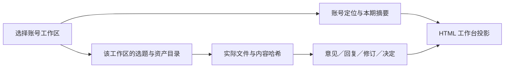

# 产物、审核与协作记录合同

状态：以当前身份工作区实现为准。读取与写入都必须经过明确的工作区范围；[工作区 API 路径生成](../../apps/workbench/src/workspace-api.mjs)、[服务端路由](../../apps/workbench/server.mjs)、[身份与摘要账本](../../apps/workbench/src/integration-store.mjs)和[正式协作账本](../../apps/workbench/src/collaboration-store.mjs)共同构成本合同的实现依据。

## 正本与投影

**实际文件是当前内容正本，清单决定它属于哪个选题、版本和工作区；HTML 只是读取与编辑投影。** 工作台不执行 Agent、不修改原文件，也不因展示了产物、摘要或发布记录就认定工作完成。

| 对象 | 正本与最低依据 | 页面和 API 的含义 |
|---|---|---|
| 工作区与账号 | `data/workbench/workspaces.json` 中的规范工作区、别名、渠道和初始定位；本机 SQLite 中的定位修订 | 旧账号 ID 可解析到同一规范工作区；定位含 `purpose`、`readers`、`promise` 的值、状态和来源 |
| 选题与版本资产 | `data/workbench/topics.json`、显式本区导入记录、实际文件、资产 ID 与哈希 | `currentReport` / `currentVideo` 和版本 `cores` 等清单字段指向当前选择；页面不从文件数量推断进度或通过状态 |
| 本期协作摘要 | 工作区 + 选题下的摘要当前投影及不可变修订历史 | 八个字段用于执行接续；摘要不是授权、内容接受或发布决定 |
| 正式意见与决定 | `data/local/workbench/collaboration.sqlite` 中的事件、事件范围快照和保存版本 | 意见、回复、修订、决定均绑定选题、资产 ID、真实哈希和范围；读取结果会计算陈旧、受影响、被替代和能否推进 |
| 历史正文版本 | 正式事件发生时保存的版本记录 | 不超过 2 MiB 的文本可保留正文快照；大媒体只保留已索引资产引用、元数据和哈希，不保证旧文件仍存在 |
| Review 文件 | 实际 Review 文件及其 `inputs[{path,sha256}]` 等原始字段 | 保留原判词、Reviewer、限制和输入版本；哈希一致只证明输入字节一致，不证明语义正确、审阅独立或当前成片通过 |
| 发布与反馈 | `data/post-publish/index.json`、真实发布包、回执和原始采集 | 空登记不能证明未发布；历史链接、截图指标和未知采集窗口不得冒充当前公开状态或当前版本表现 |

输入版本核对只有一致、已变更、有输入缺失、无法核对四种结果。没有 SHA 不补造 SHA。精确原文引用必须存在于当时可保存正文中；音视频时间点是人工登记的非负秒数；无法精确核对时只登记文件级位置。采集工具在工作台外执行，平台 API、浏览器采集、用户导出或截图都须保留方法和日期，不可访问时标未知。

## 工作区 API 与身份隔离

先用 `GET /api/workspaces` 选择工作区。除该列表外，所有 API 都使用 `/api/workspaces/:workspaceId/...`；无工作区范围的旧式 `/api/...` 读取返回 `WORKSPACE_REQUIRED`，写入被拒绝。前端默认工作区是 `token-economics`，但执行者仍应显式携带目标 ID，不依赖默认值。

主要读取路径：

- `GET /api/workspaces/:id/identity`
- `GET /api/workspaces/:id/inventory`、`catalog`、`search`
- `GET /api/workspaces/:id/collaboration-summary/:topicId`
- `GET /api/workspaces/:id/collaboration/:topicId?assetId=:assetId`
- `GET /api/workspaces/:id/fingerprint/:assetId`
- `GET /api/workspaces/:id/artifact/:assetId` 或 `asset/:assetId`

当前写入路径接受 JSON 的 `POST` 或 `PUT`：

- `/api/workspaces/:id/identity`：保存账号定位；必须带当前 `expectedRevision`、唯一 `clientOperationId` 和 `actorType`。
- `/api/workspaces/:id/collaboration-summary/:topicId`：保存本期摘要；同样使用修订号和操作 ID 防止覆盖并发更新。
- `/api/workspaces/:id/collaboration/:topicId/events`：登记意见、回复、修订或决定；绑定已索引资产 ID、真实 `expectedHash`、位置和整体或局部范围。
- `/api/workspaces/:id/imports`：把另一个工作区中逐项选择且哈希匹配的资产复制成当前工作区的冻结导入版本。
- `/api/workspaces/:id/candidates`：手工登记或更新当前账号的候选线索；不会自动访问链接或启动生产。

`workspaceId` 先解析别名，再归入规范工作区。一个选题只属于一个工作区；资产读取、搜索、发布记录、候选和写入都按该范围过滤。现有选题归属不能靠改清单静默迁移，历史事件保留原归属与范围快照。跨工作区导入只复制明确选择且哈希一致的文件，不继承来源账号的意见、接受、发布或内容承诺；导入文件改变后会被拒绝为原冻结版本。`history-unassigned` 是唯一历史待归属区，不应被当成任一账号的默认素材池。

`actor` / `actorType` 只有 `user`、`proxy`、`agent`、`technical`，都是本机自报来源，不是身份认证。非 `user` 不能新增或改变“已确认”的账号定位。代理决定只有在选题清单已明确配置 `collaboration.proxyAuthorization.enabled` 和来源时才能推进，仍不等于用户本人确认；执行者和技术审阅不能授予推进权限。服务不会启动后台 Agent。

## 意见、修订与接受范围

每次新写入使用 8–100 位的唯一 `clientOperationId`。身份与摘要账本、工作区导入与候选账本、同一选题的正式事件账本各自按请求内容幂等重放；在对应幂等范围内，相同操作 ID 携带不同内容会冲突。定位和摘要还必须匹配当前修订号，409 后执行者应重新读取并合并最新记录；只有实质取舍无法从已确认上下文解决时才交给用户，不能直接覆盖最新记录。

正式协作有四种事件：

1. `feedback` 提出意见。
2. `response` 回应同一资产、同一哈希的原意见，并登记 open、addressed 或 resolved。
3. `revision` 把实际不同的新版本关联到已保存的父版本、所处理的意见和受影响资产。它登记真实修订关系，不会替执行者创建或改写文件。
4. `decision` 对当前资产和明确范围登记 accept 或 return，并单独声明是否推进。

接受可以是 `whole` 或 `partial`。局部接受只覆盖 `scope.label` 明示的范围，不能外推到整份资产、整期内容、其他账号或发布。后续修订若以该资产为父版本或把它列入 `impactAssetIds`，相关决定需要复验；文件哈希变化、同范围后续决定或退回也会使旧决定陈旧或被替代。只有未陈旧的接受决定、明确 `advance: true`，且来源是用户或具备清单授权的代理时，读取结果才会标为可推进。用户确认也只由未陈旧的用户接受决定产生。

## 执行者接续与登记产物

执行者开始一轮工作时：先读取工作区列表并锁定创作者身份工作区，再读取该身份的账号定位、目标选题目录、本期摘要和完整协作记录；按待处理意见打开对应资产，并用 fingerprint 或协作读取返回的哈希确认正在处理的版本。摘要中的 `currentTask`、`next` 和 `unresolved` 用来接续工作，具体接受范围始终以资产决定为准。

若摘要的任务或下一步落后于后续资产、决定和回执，先按相同版本与范围核对时间顺序，分别说明“内容已交付”和“流程建设待办”，不依旧摘要重做或重发。意见仍为 open/addressed，但后续选择、修订或接受可能已处理实际问题时，说明记录闭环缺口并列关联证据；后续接受不自动关闭所有旧意见，也不允许执行者冒充用户补确认。只有本轮获准写协作记录且依据充分，才以真实执行者角色补回应或摘要。

服务不可达且本轮不启动服务时，可只读清单及 SQLite 持久账本恢复上下文，明确没有验证在线 API/页面投影；不要将数据库只读核对描述成页面可用或改写账本绕过正式接口。

新产物先写入项目允许的真实目录，再按项目清单流程把文件登记到对应选题和版本，生成可读取的资产 ID；工作台目前没有“任意动态注册本地产物”的 API。分散在其他本地项目的历史成果可在 `data/workbench/topics.json` 的 `externalArtifacts` 中逐文件登记绝对真实路径，再由版本 `cores` / `artifactUris` 等清单字段关联；只开放登记文件，不递归开放父目录，也不复制原件。若素材已属于另一账号，应使用 `/imports` 显式冻结导入，而不是直接复用其接受状态。

文件完成并进入索引后，执行者重新读取指纹。只有它确实修订了一个可核对的父版本时，才使用 `revision` 事件登记新版本、父版本哈希、处理的意见和下游影响；全新资产没有真实父版本时不虚构修订关系。随后更新本期摘要，写清当前任务、结果、下一步和未决问题。决定由有权来源另行登记，不能夹在摘要或修订说明中冒充接受。若新文件尚未进入清单和索引，只能报告待登记，不能用路径直接提交正式事件。

## 存储与安全边界

账号定位、摘要、显式导入和候选保存在 `data/local/workbench/workspaces.sqlite`；正式协作事件、范围和保存版本保存在 `data/local/workbench/collaboration.sqlite`；`.cache/workbench/index.sqlite` 只是可重建索引。这些本机私有账本不入仓，需要单独备份。新修订事件不会自动修改选题清单的当前版本指针。

服务只绑定 `127.0.0.1`，校验本机连接、Host、Origin 和 Fetch Metadata；请求体只接受未压缩 JSON 且最多 64 KiB。资产必须已索引、属于当前工作区并位于允许真实目录，符号链接不能逃逸。HTML 源码按文本呈现，Markdown 禁用原始 HTML，外部图片不自动加载。媒体目录默认仓库相邻的 `self-media/videos`，可通过 `TOKEN_MEDIA_ROOT` 显式指定。未经另行安全、认证和发布边界设计，不把内部工作台公开部署。

尚未覆盖任意历史 Review 格式、商业报告访问控制、平台直接拉取、任意动态产物注册、自动排程、自动 Agent 或自动发布；不得将这些描述为已实现。
