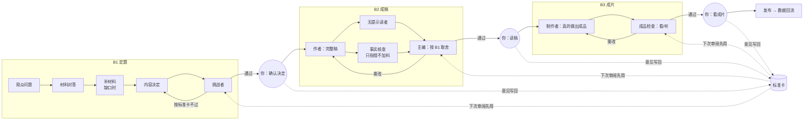

# B1 / B2 / B3：每个阶段在解决什么，workflow 怎么长

状态：v1，2026-09-30。B1、B2 已实现并在 Kimi/GLM 题上真跑；B3 按本文设计待实现。代码：`src/stages/`，标准卡：`src/stages/standards/`，运行：`pnpm stage <b1|b2> <input.json>`，阶段页面：`pnpm stage:render <topicId> [runId]`。

## 一句话

**每个阶段 = 一个决定 + 一份主资产 + 一张审阅标准卡。** workflow 里的每个角色都对应这个阶段最常见的一种失败；阶段结束停在用户这道闸，用户的每条意见写回标准卡，直到 workflow 内部审阅者和用户判断一致，这道闸才交给 agent。

## 之前 Codex 建的是什么，为什么不好用

| | 旧版（worktree 663d，09-27/28） | PR #1 版（09-29） |
|---|---|---|
| B1 | 作者写 `content-brief`；证据审阅 + 内容编辑并行；claim 逐条标 verified/decisive，全部 SHA 绑定 | 一次模型调用出 `content-definition` + zod 校验 |
| B2 | 作者 → 无提示读者 + 独立编辑 → 仲裁；先核心稿再完整声画设计 | 作者写全文 → 审阅 → 修订（通用文章） |
| B3 | **只登记成品文件和人工检查记录，明确不制作媒体** | 未实现 |

背后的思路是"防假通过"：可追溯、哈希、独立审阅、不把结构有效当质量。这些本身没错，但它们防的是"说了没证据的话"，没防住真正让内容失败的三件事：

1. **B1 从材料出发。** 输入是研究摘记，问题被写成"材料分别怎样展示 X"。观众不会这样问。
2. **审阅只加不减。** 证据审阅把每个没披露的细节都要求补进口播，开头被推成免责声明，作者 agent 连续三次收敛失败，主 agent 只好自己写"主编种子稿"。
3. **B3 不做东西。** 视频 v1–v7 是主 agent 在 workflow 外手工做的，workflow 事后登记。

另外有一个环境问题反复触发"主 agent 接手"：SDK 自带的 Codex CLI 0.154 在 ChatGPT 账号下拒绝 GPT-6 模型。现在 stage 运行把 SDK 指向 ChatGPT App 内的 CLI（`CREATION_CODEX_BIN` 可覆盖），gpt-6-sol 可用。

## B1 定题

**本质问题：选对这一篇要回答的问题，并确认我们答得上、答得好。**
观众的疑问、我们手里的材料、账号能提供的视角，三者不会自动对上。B1 要把它们对上；对不上时，先补材料，补不上就缩小承诺，但不能偷换成材料好答的问题。

| 角色 | 防什么错 | 产出 |
|---|---|---|
| 观众问题 | 从材料出发选题 | 观众原话式的问题、他们现在的直觉、矛盾点、看完的变化、"有人关心"的依据分级 |
| 材料对答 | 材料答非所问 | 子问题逐个判 direct/partial/none；"这批材料真正回答的是什么"；决定性缺口 |
| 补材料（有缺口时，可联网） | 为迁就材料而换题 | 一手来源笔记（URL、要点、填补哪个缺口） |
| 内容决定 | —— | 一页决定：核心问题、一句话答案、钩子、3–5 个节拍（带依据）、账号视角、载体、不讲什么、最大风险 |
| 挑战者（最多 2 轮修订） | 替你先审 | 按标准卡 S1–S8 逐条 ok/weak/fail；只提会改变结果的意见，禁止要求加免责 |

结束于你的闸：确认、改、或退回。标准卡：`src/stages/standards/b1.md`。

## B2 成稿

**本质问题：让一个对的答案被观众跟上，并愿意看完。**
B1 决定了"讲什么"；B2 决定"按什么顺序、用什么例子和画面讲"。它的主要失败是准确性和注意力互相挤：审阅只要求补充，稿子就越改越密。

| 角色 | 防什么错 | 产出 |
|---|---|---|
| 作者 | —— | 完整稿：标题/封面字、口播全文（按秒）、每段画面意图 |
| 无提示读者（只看观众能看到的部分） | 讲不懂、留不住 | 复述学到了什么；在哪里走神、在哪里跟丢；10 秒/30 秒还会不会看 |
| 事实核查 | 说错、说过头 | 只标错误和越界，每条附同长或更短的改法；**不得要求增加内容** |
| 主编（以 B1 决定为准取舍） | 意见互相打架、稿子越改越长 | 本轮必须改的清单、字数/时长预算、通过或修订 |

结束于你的闸：读稿。标准卡：`standards/b2.md`。修订次数用完时，作者仍按主编最后一轮意见改一次（不再重审），交给你的是改过的那一版，状态标"已按主编最后意见改完"。

## B3 成片

**本质问题：成品把稿子讲出来了，而且在手机上能看。**
文字到声画的翻译会丢东西：字幕挡住图、节奏和口播对不上、画面信息过密。B3 必须真的制作，而不是登记别处做好的文件。

| 角色 | 防什么错 | 产出 |
|---|---|---|
| 制作者（有写权限，用 HyperFrames/TTS 工具链） | 不做事、只登记 | 先做 15–20 秒样片，再做全片；三平台预览 |
| 成品检查（看抽帧和整段、听转写对齐） | 遮挡、节奏、声画不同步 | 按时间点列问题和改法 |

结束于你的闸：看成片，然后发布。发布数据挂回这一篇，作为下一次 B1 的输入。

## 怎么评估这套 workflow

分四层，前两层每次运行自动记录，后两层靠人和数据：

1. **自主性**：每个阶段的主资产是不是 workflow 里的角色产出的；主 agent 有没有代写。代写一次就算这一阶段失败。
2. **收敛**：修订轮数、是否 not-converged、耗时。
3. **审阅一致性（最关键）**：同一份资产，workflow 内部审阅者（挑战者 / 主编 / 成品检查）的判断和用户的判断逐条对照：一致、它漏了、它多挑了。一致率就是"这道闸能不能不用你"的指标。每次你的意见写回标准卡，下一篇看一致率有没有上升。
4. **结果**：成片发布后的完播率、互动，与参照作品比（EP01 完播 5.32%、平均 26 秒）；以及你愿不愿意发。

改 workflow 时，用同一份冻结输入重跑，对照新旧版本的产出和一致率，避免"改了很多但说不清哪次有效"。

## 运行记录

| 日期 | 阶段 | 题目 | 结果 | 审阅 |
|---|---|---|---|---|
| 2026-09-30 | B1 第 1 轮 | Kimi/GLM：弱模型怎么训出强模型 | 3.9 分钟；材料对答判"材料答非所问"并自动联网补材料；挑战者 1 轮 pass | 代理审阅 **revise**（与挑战者不一致）：放弃了创作者指定的 Kimi/GLM 案例、一句话答案泄气、账号视角偏薄 → 新增标准 S9 |
| 2026-09-30 | B1 第 2 轮 | 同上，带审阅意见与定向补材料请求 | 补到 Kimi K3、GLM-5、DeepSeek-R1 的一手段落；挑战者 pass | 代理审阅 **accept**（一致，但挑战者见过审阅意见，不算独立校准） |
| 2026-09-30 | B2 第 1 轮 | 同上 | 9.8 分钟，3 版，主编均判 revise；T 类 fail 从 2 条降到 1 条；事实核查只指错、未要求加料 | 方向对；最后一轮主编意见没人执行 → 改为"次数用完仍照改一次" |
| 2026-09-30 | B2 续跑 a0ac8b5c | 同上 | **无效运行**：续跑时"照改"步骤编号与前一步重复，被框架当作已完成复用，主编意见未执行，状态却写"已改完"。已修复（b2-v3：步骤按计数器编号 + 回归测试） | —— |
| 2026-09-30 | B2 第 2 轮 | 同上，带代理审阅（改四段结构） | 7.6 分钟；结构改后 Kimi 段不再跟丢，GLM 段仍密；照改后事实核查剩 1 处 | 审阅：结构通过；附两处修改（事实 + 账号视角） |
| 2026-09-30 | B2 收尾 | 通过但附修改（只改一次 + 事实核查） | 1.2 分钟；**事实核查拦下了审阅者自己写错的一句**（"现场一直开着"与 Kimi 原文相反）；更正后再跑 1.3 分钟，0 问题 | **accept**，进入 B3 |

B1 合计约 7 分钟、8 次模型调用；B2 合计约 23 分钟、30 次调用。所有稿件都由 workflow 内的角色产出，主 agent 没有代写；人的介入只有审阅意见（B1 两次、B2 两次）。

教训反写：B2 发现的结构问题根因在 B1 节拍交错安排 → B1 标准卡新增 S10"一个案例只承担一个节拍"。
