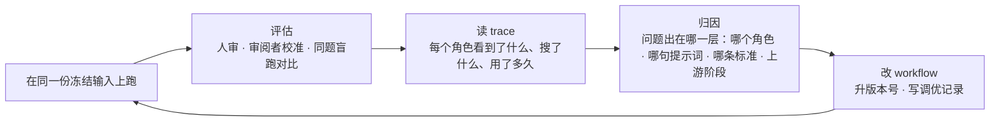
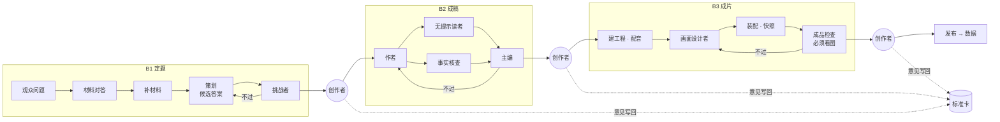

# 用 workflow 做内容：B1 / B2 / B3 与调优循环

状态：2026-09-30。三个阶段都已实现，并在 Kimi/GLM「弱模型怎么训出强模型」上从 B1 跑到 B3 成片（占位配音）；阶段之间通过**作品档案**交接。调优版本：B1 v7、B2 v7、B3 v9。完整输入输出图：[stage-flow.html](stage-flow.html)。
分阶段说明：[B1 定题](stages/b1.md) · [B2 成稿](stages/b2.md) · [B3 成片](stages/b3.md)

## 核心思路：workflow 是调出来的，不是设计一次就对的

之前 Codex 没做好，缺的就是这个循环：它把 workflow 当成一次性的工程交付（测试通过、流程跑通就算完成），没有拿真实内容反复跑、没有看 trace 找病因、没有用同一份输入对比改动有没有用。

## 每个阶段的形状

**一个阶段 = 一个决定 + 一份主资产 + 一张审阅标准卡。** workflow 里每个角色对应这个阶段的一种常见失败；阶段结束停在创作者闸；创作者的每条意见写回标准卡。

| 阶段 | 本质问题 | 主资产 | 审阅者 |
|---|---|---|---|
| B1 定题 | 选对这一篇要回答的问题，并确认答得上、答得好 | 内容决定 | 挑战者（S1–S10） |
| B2 成稿 | 让答案被观众跟上，并愿意看完 | 完整稿 | 无提示读者 + 事实核查 + 主编（T1–T8） |
| B3 成片 | 成品把稿子讲出来，而且在手机上看得清 | 成片 + 快照 | 成品检查（V1–V7，必须真的看图） |

## 阶段之间怎么交接：作品档案

以前 B1→B2、B2→B3 的输入是主 agent 在会话里临时拼的，丢了观众问题、参照作品教训、一句话答案和主编写给制作的话。现在：

1. 创作者在某个阶段判通过：`pnpm stage:accept <topic> <runId> --verdict accept --reviewer <名字> [--note 对这一版的意见] [--next 留给下一阶段的话]`。
2. 程序从这次运行自己的产出和冻结输入生成下一版档案 `brief/v<n>.json`（`src/stages/brief.ts`），并把审阅挑战者/主编没解决的"偏弱"项自动放进"写给下一阶段的话"。
3. 下一阶段的输入写 `"briefFrom": "<topic>"`，档案被原样冻结进这次运行的输入。
4. 每个角色只拿自己那一份（冷读者仍然隔离，B3 不拿原始研究材料）。评估用的运行加 `--keep-current`，不替换作品当前采用的版本。

**对照实验**（同一份 B1 决定、同一份标准，只改交接）：B2 开头从概念题（"先看清'自己'……"）变成直接打中观众直觉（"老师不够强，学生凭什么更强？"），并用了工作台、交卷箱、练投篮三个具体类比；两边都 1 轮通过，冷读者的 30 秒反应一次一个样，单次结果不下结论。B3 样片第 1 轮第一次没有不通过项，0 秒就画出了观众的直觉对比（同时有首帧规则的改动，不是单一变量）。开头仍缺具体数字——那是 B1 v7 决定没带，档案不能传递上游没决定的东西。

## 评估：四个问题

1. **内容是 workflow 做出来的吗？** 每份资产都有生产者记录；主 agent 代写一次就算这一阶段失败。本次全部由 workflow 角色产出。
2. **它自己收得住吗？** 修订轮数、是否"没收敛"、用时。
3. **它的审阅者和人判断一致吗？**（能不能撤掉人工闸的依据）用 `pnpm stage:eval-reviewer` 把人已经判过的资产喂给审阅者：既要拦得住坏的，也不能错杀好的。
4. **同一份输入，改完比改之前好吗？** 同题盲跑：不给人工意见、标准卡去掉本题审阅记录，看需要人介入的程度有没有下降。最终结果还要看发布后的数据。

## 工具

| 命令 | 用途 |
|---|---|
| `pnpm stage <b1\|b2\|b3> <input.json>` | 跑一个阶段；资产逐个写成文件；状态在 `.local/stages/<topic>/`（不进仓库） |
| `pnpm stage:render <topic> [runId]` | 阶段页面：这一阶段的决定 → 审阅对照 → 为什么是这些角色 → 进度 → 输入 → 全部产出 |
| `pnpm stage:trace <topic> [runId]` | 每个角色每次调用：用时、tokens、搜索词、错误、对应的 Codex 会话文件（可交给 session-forensics 细读） |
| `pnpm stage:eval-reviewer <b1\|b2> <casesDir>` | 审阅者校准：一致率、漏判项、多判项 |

## 这次调优里最重要的几个发现

- **内容角色被灌入了工程规范。** trace 显示每个内容 agent 开跑前先收到 ~18k 字的 AGENTS.md（模型路由、提交、"区分事实与推断"的汇报要求），连"普通观众"角色也不例外。之前所有 Codex 做的创作 agent 都是这样跑的。现在关掉项目文档注入，并告诉内容角色全局工程约定不适用。
- **模型"不可用"是环境问题。** SDK 自带的 Codex CLI 0.154 拒绝 GPT-6；指向 ChatGPT App 里的 CLI 后可用。之前三个会话因此让主 agent 接手。
- **审阅者既会太松也会太严。** 太松放过丢掉指定案例的决定（b1-v1），太严把正确答案审成"暂缓"（b1-v5）。只有同时带正反案例的校准集才能调准。
- **下游修不好的问题常在上游。** B2 连续卡在同一段，根因是 B1 的节拍安排；修法写回 B1 的标准卡。
- **人的修改也要核。** 事实核查拦下了代理审阅者自己写错的一句。

## 这一轮的评估结论：行不行？

**行，但只在一个题目上证明过。** 按上面四个问题逐项：

| | B1 定题 | B2 成稿 | B3 成片 |
|---|---|---|---|
| 内容是 workflow 做的吗 | 是（所有版本） | 是（所有版本） | 是：画面设计者写帧、程序装配渲染，主 agent 未动一帧 |
| 自己收得住吗 | 调优前需要人纠正方向；b1-v6 盲跑 1 轮通过，b1-v7 盲跑 3 轮通过 | 调优前三份决定上都跑满 3 轮不收敛；b2-v6 在同一份决定上 1 轮通过 | 样片 2 轮、全片 2 轮（含 1 轮技术修复） |
| 审阅者和人一致吗 | 挑战者校准 4/5 放行一致、人判不通过项零遗漏（比人严） | 主编校准 2/2 完全一致 | 调优前两次漏判（数字卡、页脚/版式重复）；调优后与人一致，但检查者见过审阅记录，未做独立校准 |
| 同一份输入改完更好吗 | 是：从"丢掉指定案例、泄气答案"到"指定案例扛起答案、0 人工介入" | 是：从不收敛到 1 轮通过，事实 0 问题 | 是：从数字卡到"只判答案"可静音看懂；全片版式问题修正 |

需要人介入的次数（这篇内容从选题到全片）：B1 1 次（调优前），B2 2 次，B3 2 次——全部是审阅意见，没有一次是人或主 agent 代写。

## 已知缺口（下一轮）

- **换题验证迁移。** 所有调优都在同一个题目上，标准卡和提示词可能对它过拟合。下一步用新题（例如 MiMo）从 B1 盲跑到 B3，看人工介入次数和审阅一致率能否保持。
- **B1 答案锋利度与节拍密度此消彼长**：b1-v6 讲清了"谁来判"但节拍太满，b1-v7 节拍轻了但钩子没有具体数字。下一版让 S2 要求说出"教"的那个角色、S4 要求具体事实，并把 v6 决定加入校准集作为 S6 反例。
- **B3 检查者还没有独立校准集**；b3-v7（技术报错带位置）尚未跑过。
- **正式配音**：需要 MiniMax 密钥（`~/.config/minimax/key` 不存在）和声音选择，目前成片是 macOS 占位音。
- **工作台**：作品工作台（`pnpm stage:workbench`）和阶段页面是独立 HTML，还没接进 React 工作台；代码在分支 `claude/stage-workflows`，未推送。
- **B2 的问题回写 B1 标准卡**仍是手工；**发布数据回流到下一篇的 B1** 还没实现。
