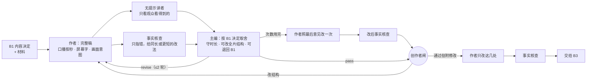

# B2 成稿 workflow

代码：`src/stages/b2.ts`（当前 `b2-v6`）　标准卡：`src/stages/standards/b2.md`　运行：`pnpm stage b2 <input.json>`

## 本质问题

**让 B1 定下的答案被观众跟上，并愿意看完。**

B1 决定讲什么；B2 决定按什么顺序、用什么例子和画面讲。它最容易失败的地方是准确性和注意力互相挤：审阅只会要求"再补一句限定""再加一个细节"，稿子越改越密，作者改不动，最后主 agent 代写（Codex 旧版 B2 的真实结局：作者 3 次失败后改为"主编种子稿"）。

## 最终形态

| 角色 | 防的错（设计动机） | 证据来自 | 产出 |
|---|---|---|---|
| 作者 | —— | —— | `b2-script`：标题、封面字、分段（时间/口播/屏幕文字/画面） |
| 无提示读者 | 讲不懂、留不住；它只拿到观众看得到的东西（测试保证拿不到 B1 决定） | 旧版审阅都读"完整候选"，没人替观众说"我在这里跟丢了" | `b2-cold-read`：复述、一句话理解、跟丢/想划走的段落、3 秒/30 秒还看不看 |
| 事实核查 | 说错、说过头；**不许要求加内容** | 旧版证据审阅把开头推成免责（01a0e23b L5537/L6997） | `b2-fact-check`：wrong/overclaim/unsupported + 改法 |
| 主编 | 意见打架、越改越长、局部修不好结构；也防另一头——因为冷读者总会在某处走神而永远不放行 | 第 1 轮 39–82 秒连续 4 版跟丢；三份决定上都跑满 3 轮 | `b2-editor`：T1–T8 判定（T1/T3/T5/T6 硬标准，其余改进项）、必须改的地方、拒绝的建议及理由、时长预算 |

## 调优记录

| 版本 | 改了什么 | 为什么（证据） | 结果 |
|---|---|---|---|
| b2-v1 | 首版 | —— | 3 版都判 revise；事实核查从未要求加料；最后一轮主编意见没人执行 |
| b2-v2 | 次数用完仍按最后意见改一次 | 交给人的是主编刚否掉的版本 | 续跑时步骤编号重复，**改稿被框架当成已完成复用、状态却写"已改完"** |
| b2-v3 | 草稿步骤按计数器编号（回归测试）；改后必过事实核查；主编可改全片结构或退回 B1；接受人的审阅 | 上面的假"已改完"；照改后又出 3 处事实错 | 按四段结构重写后 Kimi 段不再跟丢 |
| b2-v4 | "通过但附修改"：只改被点名的几处，只过事实核查 | 再跑完整主编循环收益递减 | **事实核查拦下了审阅者自己写错的一句**；更正后 0 问题，接受 |
| b2-v5 | 内容角色声明（同 B1）；作者：一个案例只占一段，贯穿图只展开一次 | B1 的 trace 发现工程规范注入；结构问题的教训 | 在 b1-v6 决定上盲跑：3 轮未收敛，冷读者始终在 Kimi/GLM 两段跟丢 → 先怀疑 B1 节拍过密，改 B1（b1-v7）；在 b1-v7 决定上再盲跑：**仍 3 轮未收敛**，但冷读者每轮都能正确复述答案 → 问题不只在 B1 |
| b2-v6 | 主编门槛分层：T1/T3/T5/T6 硬标准；T2/T4/T7/T8 改进项，只有同段连续两轮跟丢且影响复述才阻止通过 | 代理审阅接受过冷读者仍有跟丢但能复述答案的稿子；主编在三份不同决定上都判满 3 轮 revise——与人的门槛不一致 | 同一份 b1-v7 决定上 **1 轮通过**，事实 0 问题，冷读者能复述；代理审阅通过（开头缺具体事实）。主编校准 2/2 完全一致（拦下有虚构细节的初稿、放行被接受的稿） |

## 经验（也写进了标准卡审阅记录）

- 同一处连续两轮没修好，就是结构问题，局部修补无效。
- 贯穿图只在第一次完整展开。
- 任何修改之后都要重新核事实——包括人给的修改。
- B2 修不好的密度问题，根子往往在 B1 的节拍安排。
