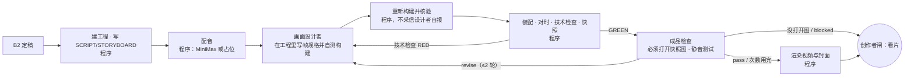

# B3 成片 workflow

代码：`src/stages/b3.ts`（当前 `b3-v3`）　标准卡：`src/stages/standards/b3.md`（v2）　运行：`pnpm stage b3 <input.json>`

## 本质问题

**成品把 B2 定稿讲出来，而且在手机上看得清。**

文字到声画的翻译会丢东西：字幕挡住图、主视觉缩在角落、画面只是一行标题而这一段真正的意思只在口播里。B3 必须真的制作——Codex 旧版 B3 写着 "It does not create media"，结果七版 Kimi/GLM 视频都是主 agent 在 workflow 外手工做的，workflow 事后登记。

## 最终形态

**范围**：先 `scope: sample`（前 N 段）做样片给创作者看，通过后 `scope: full` 做全片。
**配音**：`voice: minimax` 需要 `~/.config/minimax/key`（本机没有）；`placeholder` 用 macOS 中文语音只验证装配线，模板会拒绝把占位音成片标记为完成。

| 角色 | 防的错（设计动机） | 证据来自 | 产出 |
|---|---|---|---|
| 程序步骤 | 装配线本来就是确定的；交给 agent 只会多出错 | 模板十三道机器闸来自 EP01/EP02 的真实事故 | `b3-script-file`、`b3-voice-manifest`、`b3-assembly`、`b3-video` |
| 画面设计者 | B3 不做东西、只登记 | 旧版 B3 README | `b3-frame-specs`：每段一个帧规格 + 构建结果 |
| 成品检查 | 视觉验收交给看不见图的 agent = 假通过（session-forensics G27） | 旧版"抽帧冒充完整检查" | `b3-inspection`：实际打开的图、V1–V7 判定、按段落的问题和改法；没打开图直接判 blocked |

## 调优记录

| 版本 | 改了什么 | 为什么（证据） | 结果 |
|---|---|---|---|
| b3-v1 | 首版 | —— | 样片：设计者引入未声明的 Space Grotesk 字体，技术检查 RED，**整个运行崩掉** |
| b3-v2 | 技术检查 RED 退回设计者作为一轮修改；设计者提示词写清字体规则 | 上面的崩溃 | 样片：技术检查 GREEN；成品检查**真的看了图**，指出"0 秒几乎是空背景""来源小字看不清"，第 2 轮通过并渲染出 16 秒样片 |
| b3-v3 | V2 加"主视觉够大"；V3 改成静音测试；设计者要把这一段的核心动作画出来 | 代理审阅判 revise、检查者判 pass：第 1 段只有数字卡，"只判答案"的钩子没上画面；第 2 段一张小题卡、大半空白 | 运行中 |
