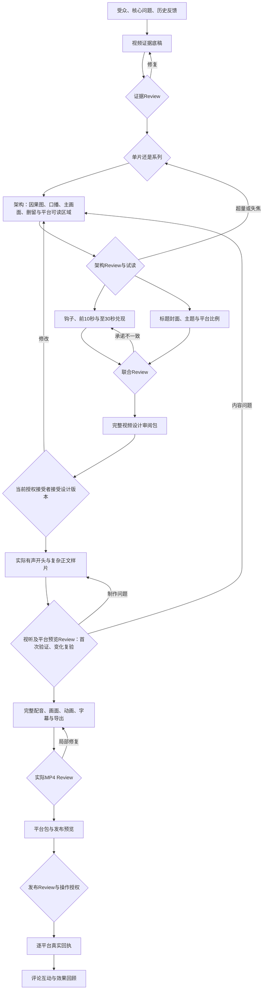

# 视频设计与制作

本页展开 B1–B3 及 C1 的内部工作，外层编号以[技能地图](skills-map.md)为准。

前提：已有用户或明确授权代理接受的报告版本与可用证据；目标是帮助观众完成一次理解或判断。先内容架构，再开头和包装，再有声样片，最后全片。目标平台从表达设计阶段就进入输入：标题、图解、字幕和来源的共用可读区域，以及封面所需比例，先随代表图设计；首次布局用有声样片在三个目标平台实际预览中检查后再扩整片；相同条件复用已有记录，新增布局、关键文字/动作越界或平台界面变化时定向复验，发布前仍核本次成品。已有旧版反馈进入目标和架构；不是把低完播率直接解释成“必须更短”。

| 步骤内工作 | 生产职责 | 应交产物 | Reviewer关注 | 工作台展示 |
|---|---|---|---|---|
| 证据转译 | 视频主编 | evidence-brief | 措辞是否超证据 | 主张与来源 |
| 内容架构 | 编导 | 因果图、完整口播草稿、主画面、平台可读区域、keep/cut | 原理是否服务判断、自然时长、手机上的信息密度 | 声画对照和架构图 |
| 钩子/包装 | 编导与视觉作者 | opening、标题封面源稿、所需比例导出、缩略图、expectation | 点击承诺与初次兑现一致、各比例保留主题与限定 | 前30秒安排、题图配对 |
| 制作交接 | 制作负责人 | SCRIPT、时间表、素材清单 | 实际声画对应 | 镜头与素材 |
| 样片 | 制作Agent | 有声开头＋复杂正文段＋目标平台预览 | 听懂、看清、跟上；平台控件、两行字幕、放大与转场不破坏阅读 | 实际播放与意见 |
| 全片 | 制作Agent | MP4、字幕、工程索引 | 当前导出事实/视听/版本 | 播放、字幕、版本 |
| 发布包 | 发布负责人 | 账号、文案、声明、封面、回执 | 实际预览、未结问题和授权 | 逐平台状态 |

执行正本：[research-to-video](../../.agents/skills/research-to-video/SKILL.md)。Reviewer使用[video-editorial-review](../../.agents/skills/video-editorial-review/SKILL.md)。工作台展示这些资产并记录意见、修订与范围决定，接续按[产物合同](../contracts/artifacts-and-review.md)；平台执行在工作台外进行。

2026-09-11发布复盘及候选脚本化方案见[来源历史主报告第9节](https://github.com/cyl19970726/token-economics/blob/1d733f4242e0464674979bf1681968b5cdc4d9e1/research/workflows/minimax-reconstruction-20260910/workflow-report.md)。本期原r2已获用户接受并提交；以上前置要求用于后续设计，不追溯强制重做本期。五步发布工具及本地模拟已实现，执行入口见[项目发布工具](../../tooling/social-publish/SKILL.md)，本轮结果集中在主报告9.6。真实平台编辑页仍需下一条未发布内容现场校准，通用视频模板也未因此完成。
