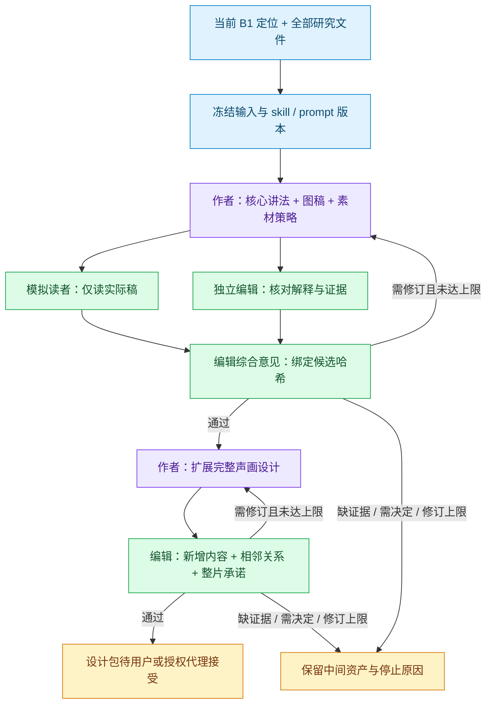

# 表达清楚：可执行的 B2 工作流

本项目使用固定提交的 [agent-workflow](../../../../vendor/agent-workflow/README.md) 执行 B2。研究文件仍是内容依据，执行账本保存实际调用、版本和审核；原有工作台和分析工作台保持独立。

## 为什么这样接入

来源执行审计（历史生产材料不随本包迁移） 暴露了方法虽存在却未可靠交付、先做完整包再发现核心讲法失败、局部通过被当成整体通过的问题。此次把这些边界写成可执行控制流；保留外层阶段，不增加日常人工批准点。



## Agent、方法与资产

| Agent | 必须收到的方法 | 输入 | 产出 |
|---|---|---|---|
| 作者 | video-evidence-brief、video-content-architecture、video-hook-opening、video-title-cover，以及版本/资产合同 | 定位、冻结研究、当前候选及修订意见 | 核心/完整稿、图稿、素材状态与替代 |
| 模拟读者 | 专门的无提示阅读 prompt；不交付作者/编辑 skill | 目标读者身份、publicDocument 与图稿及候选哈希 | 复述、具体位置的困惑 |
| 独立编辑 | video-editorial-review，以及版本/资产合同 | 候选、冻结证据；综合意见阶段才收到读者反馈 | 候选哈希、结论、定位明确的修改要求 |

作者输出将 `publicDocument`（观众正文）与 `document`（设计、证据、自检）分开。读者只收到前者与图稿；作者自检、预期答案、素材清单不进入读者输入。编辑仍读取完整候选，审核哈希绑定整份候选版本。

实际 prompt、JSON 输出合同和方法列表维护在 [config.mjs](config.mjs)，执行顺序在 [workflow.mjs](workflow.mjs)。SDK 收到方法全文与版本；结构验证、候选哈希绑定和分支控制由程序执行。不得把“已交付 skill”写成“模型已经正确遵守”。

## 安装与使用

需要 Node 22.13–25、pnpm 9 和可用的 Codex 登录。新 checkout 先初始化固定版本的子模块，再安装与构建：

```sh
git submodule update --init --recursive
pnpm install --frozen-lockfile
# 在仓库根构建共享runtime后，从creation包运行
pnpm --filter @creator-lab/creation test:expression
```

准备一个本地 JSON 定位清单；研究路径相对于清单文件，须是完整研究正文，可列多份。可选 sha256 用于拒绝意外变化：

```json
{
  "workspaceId": "token-economics",
  "topicId": "ai-request-journey",
  "goal": "解释一次 AI 请求如何经过模型、软件与数据中心，直到返回答案",
  "readers": ["对 AI 算力感兴趣的非专业读者"],
  "positioning": "本期沿一次请求讲清对象、数据变化与结果；研究深度保留在报告中",
  "research": [{"id": "report-1", "path": "./report.md"}]
}
```

```sh
pnpm --filter @creator-lab/creation expression -- prepare /absolute/path/input.json --model gpt-5.6-sol --effort medium
# 使用 prepare 返回的 snapshot 路径
pnpm --filter @creator-lab/creation expression -- run /absolute/path/snapshot.json
pnpm --filter @creator-lab/creation expression -- status /absolute/path/snapshot.json
pnpm --filter @creator-lab/creation expression -- export /absolute/path/snapshot.json
pnpm --filter @creator-lab/creation expression -- resume /absolute/path/snapshot.json
```

prepare 只冻结输入，不调用模型。run 才调用真实 Codex，使用显式指定模型，不静默回退。执行中断后使用同一快照恢复，成功验证的节点复用；改变方法、prompt 或执行代码应重新 prepare、新建运行。达到修订上限或真实范围冲突会停止，不无限重写。

## 工作台与验收边界

运行数据存放在忽略提交的 `data/local/expression-workflow/`：冻结快照、SQLite 执行账本和私有 trace。每次发布的中间资产有版本/哈希、生产者与依赖。export 供本地审阅实际资产与当前状态，不把私有 prompt、原始 trace 或凭据暴露到工作台。

本次是可运行的 B2 执行入口，**尚未接入工作台实时视图或自动登记当前稿**。主编按现有 [产物与审核合同](../../docs/contracts/artifacts-and-review.md) 登记审核后的设计版本；不能直接修改协作账本冒充用户接受。最终 `needs_review` 表示等待接受，不表示制作或发布授权。本入口不生成配音/视频，不提交平台内容。

图稿当前以文本或内联 SVG 内容交付；模拟阅读不等于真正观看渲染画面。B3 仍需实际样片、声音和平台布局复验。自动化测试验证控制流、隔离输入和恢复，不证明作品质量；真实同题试跑与用户接受是下一层方法有效性证据。
