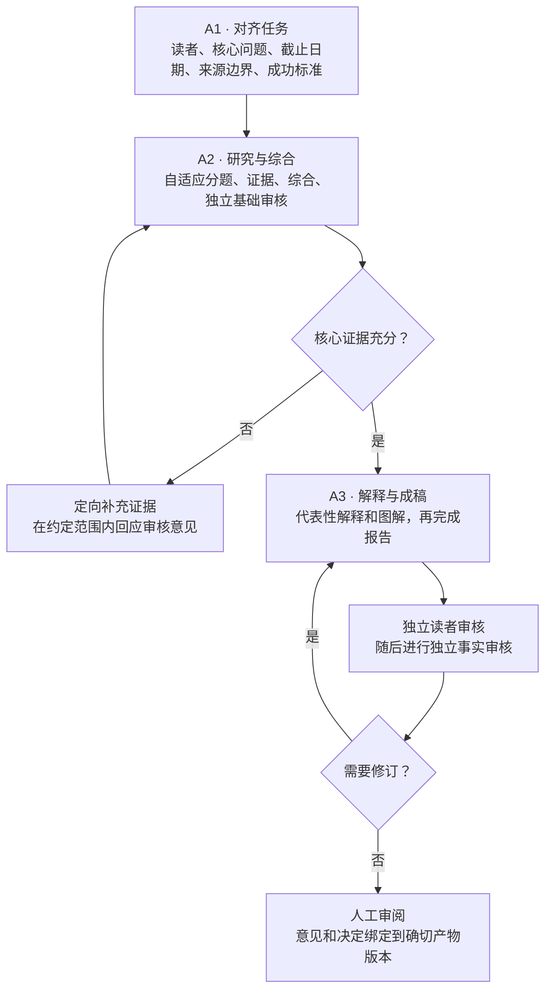

# 研究工作台

研究工作台是 Creator Lab 中独立运行的一个产品模块，沿用 Node 24、Fastify、React/Vite、SQLite 和独立 worker。代码与方法包快照来自 [research-workbench](https://github.com/cyl19970726/research-workbench)，固定源提交为 [`e27c5e518e84c098de68470a415c72e270bcf488`](https://github.com/cyl19970726/research-workbench/tree/e27c5e518e84c098de68470a415c72e270bcf488)。Agent Workflow 包和 pnpm 锁文件由 Creator Lab 根工作区共享；七个研究 Skills 保存在本目录的 `.agents/skills/`。

## 启动

在 Creator Lab 仓库根目录安装依赖后，执行：

```sh
pnpm build
pnpm research
```

打开 <http://127.0.0.1:4327>。API 仅监听本机，并提供构建后的网页。研究 worker 独立运行；需要执行研究时，在第二个终端运行 `pnpm research:worker`。启动 API 不会自动启动 worker 或创建研究任务；用户发起新任务后，worker 才会调用配置的模型。开发网页可运行 `pnpm --dir workbenches/research dev:web`，Vite 地址为 <http://127.0.0.1:4328>，并将 API 请求代理到 4327 端口。

## A1 → A2 → A3



Worker 执行有界的工作流尝试；API 和阅读器展示不可变产物及其精确版本上的意见。软件检查与模拟读者结果不能证明真实模型质量或用户接受。

## 数据边界

迁移内容包括应用源码、测试、七个完整的项目内 Skills，以及架构、开发和存储说明。源仓库的 `.local` 数据库、来源文件、产物、私有调用记录、历史报告和模型运行记录均未迁入；目标工作台不含这些历史数据。首次使用时本地状态目录为空。

默认数据位置相对于本工作台目录：

- `.local/content/manifest.json`：选题与来源清单；来源文件按清单中的相对路径存放。清单不存在时，API 可以启动并返回空选题列表。
- `.local/state/research.sqlite`：研究运行状态；`.local/state/collaboration.sqlite`：精确版本上的意见与决定。
- `.local/artifacts/`：从结构化产物导出的 Markdown 文件。

选题与来源目前是只读输入，产品没有原生的选题/来源登记界面或写入 API。准备好清单和来源文件后，界面会把所选来源冻结到新运行中；清单格式和校验边界见[存储说明](docs/storage.md)。历史报告文件不会被当作已完成的 A1/A2/A3 工作流导入。若将既有文本登记为来源，它也只是普通来源材料。

更多实现说明见[架构](docs/architecture.md)、[开发](docs/development.md)和[存储](docs/storage.md)。这些文档中的验证记录对应各自标注的源工作台日期。

## 本次迁移核验

2026-09-26 使用 Node 24.21.0、pnpm 10.28.2 执行 `pnpm --dir workbenches/research check`：构建、类型检查通过，35 项测试通过。另以全新的临时 state/content/artifact 目录启动 API（没有清单、历史状态或来源文件），健康检查、空选题列表和网页首页均返回 HTTP 200。核验期间没有启动 worker 或模型；这不构成真实研究质量或用户接受的证据。
