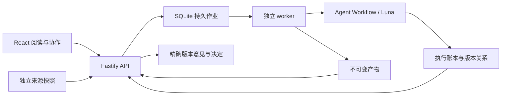

# 已采用的产品架构

2026-09-22：用户确认使用独立产品仓库，旧 token-economics 随迁移逐步退出。首版采用本地单人基线；远程登录、多人权限与发布渠道后续单独设计。

## 栈与进程

React + Vite 承担阅读和协作交互；Fastify + TypeScript 承担命令、校验和查询；Node.js 24 LTS 上的独立 worker 执行研究。pnpm workspace 固定依赖。迁入研究引擎和服务暂保留经过测试的 JavaScript；API 和前端通过同一个 TypeScript/Zod 合同连接。

Agent Workflow 固定在 `347aff2e19136a4d2482ddfe8fc6da64460f954c`。消费其公开 RunStore、CodexSdkRunner、资产身份和读模型；通用内核继续留在上游仓库。这一轮没有修改上游。

## 唯一事实来源

- 来源：content manifest 与独立来源文件，读取时校验 SHA-256。
- 研究正文：当前正本是 Workflow 数据库中的完整 artifact payload；Markdown 文件是派生导出，前端阅读器从 payload 渲染。payload SHA 与派生文件 SHA 分开保存，不把派生文件当第二份正文正本。
- 执行：Workflow RunStore；产品作业表只负责领取、租约、取消与恢复。
- 协作：独立 SQLite 事件，包含 run、artifact id、revision、payload SHA 和接受范围。运行成功、审核通过都不代表用户接受。
- 前端：共享 read-model 的可重建展示投影，不另外写一套研究状态。

同一选题允许多次研究/补证/修稿运行。修订必须指向真实评论和具体稿件，形成新稿、修改记录和新的独立审核。表达修订仅在旧底稿与基础审核被验证后复用 A2；证据修订回到研究。

## 方法与交付

A1 明确读者、问题与材料；A2 预研后决定分题，并以独立基础审核约束有限次补证；A3 先完成代表解释和图解，再成稿并分别接受模拟读者与事实审核。所有角色固定 `gpt-5.6-luna` / medium。方法包在项目 `.agents/skills/`，启动时冻结完整原生包，实际执行从冻结包读取。

软件测试只证明控制流、版本与恢复规则。真实模型效果、浏览器可读性、用户意见和用户接受分别取证。模拟读者不是用户，读取 Mermaid 源码也不等于视觉审图。

## 恢复与升级

API 与 worker 可独立重启。单主机 worker 用 SQLite 单例租约与进程身份校验串行领取，数据库记录取消请求。意外中断后明确恢复，重新给定有界执行预算，已完成步骤依赖 Workflow 重用规则。恢复核对实现与方法指纹，若定义已变更则明确拒绝，不悄悄用新方法续旧记录。首版未提供跨版本定义迁移；可新建研究并引用仍可校验的来源。

SQLite 使用 WAL，仅用于单主机本地存储。私有状态、来源和产物目录分开配置；不把数据库放网络共享盘当分布式服务。扩大到远程多人服务前需设计认证、授权、数据库和部署，而非直接绑定公网。

## 选择依据

已有浏览器状态与协作复杂度适合 React 组件，单体 API 降低首版运维成本，独立 worker 解除页面服务与长任务生命周期的绑定。没有 SSR、搜索引擎收录或跨机执行需求，因此暂不引入 Next、微服务与分布式队列。

参考：[Node 发布周期](https://nodejs.org/en/about/previous-releases)、[React 构建应用](https://react.dev/learn/build-a-react-app-from-scratch)、[Fastify LTS](https://fastify.dev/docs/latest/Reference/LTS/)、[Vite](https://vite.dev/guide/)、[Workflow 前端协议](https://github.com/cyl19970726/agent-workflow/blob/347aff2e19136a4d2482ddfe8fc6da64460f954c/docs/frontend-integration.md)。

## 2026-09-23：取消旧报告兼容要求

用户明确不再要求兼容旧报告。新协议只使用 Workflow 的确切资产身份；移除旧目录适配接口、公开 legacyAssetId 和旧报告导入命令。保留现有来源与本产品产生的运行记录。当前结构及尚未完成的原生资料管理见 [存储说明](storage.md)。
